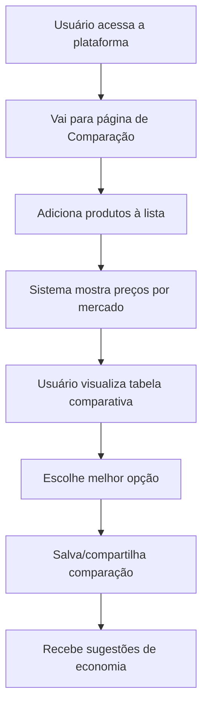
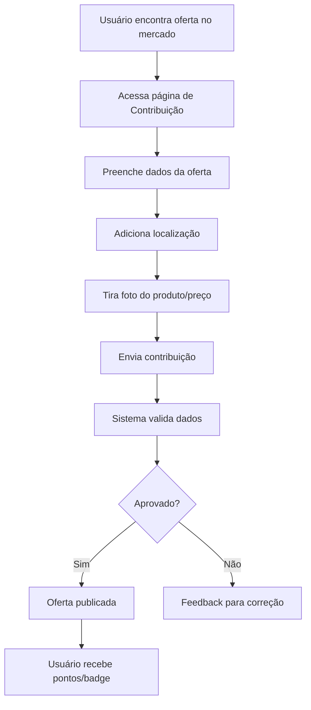
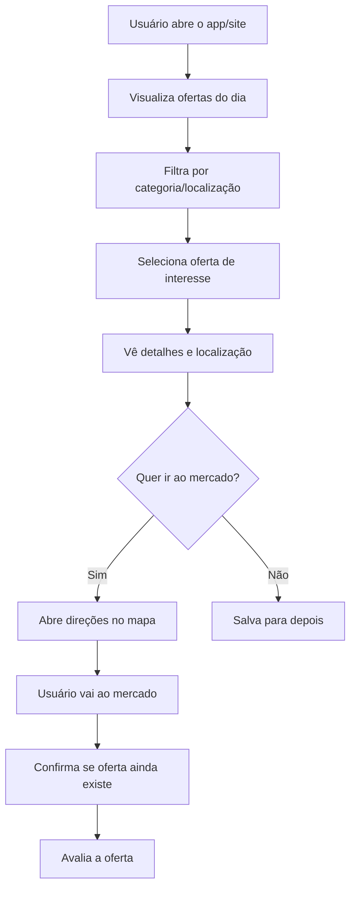
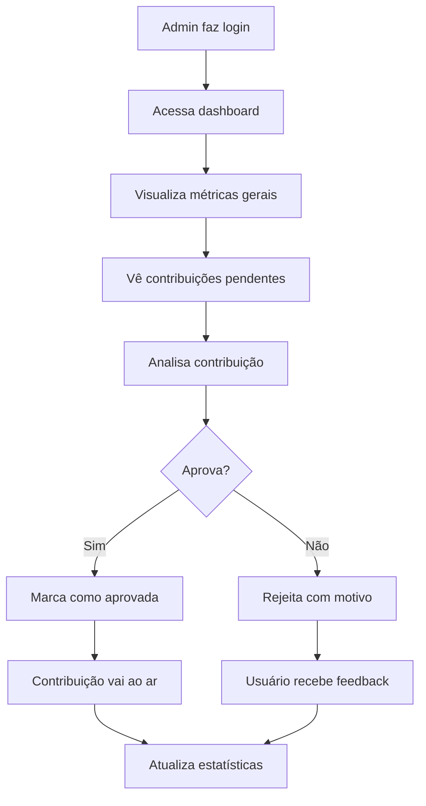

# 02 - Personas e Fluxos de Usuário

## 👥 Personas Principais

### 1. 🏠 Maria - A Dona de Casa Econômica

**Demografia**
- Idade: 35-45 anos
- Localização: Região metropolitana
- Renda: Classe B/C
- Tecnologia: Smartphone Android, WhatsApp

**Comportamento**
- Faz compras semanais em 2-3 mercados diferentes
- Compara preços manualmente antes de grandes compras
- Ativa em grupos de WhatsApp sobre ofertas
- Busca economia para a família

**Objetivos**
- Economizar 10-15% no orçamento mensal
- Encontrar ofertas rapidamente
- Planejar compras com antecedência
- Compartilhar boas ofertas com amigas

**Dores**
- Tempo perdido visitando múltiplos mercados
- Dificuldade em lembrar preços
- Ofertas que vencem rapidamente
- Falta de informação sobre promoções

**Como usa o produto**
- Consulta preços antes de sair de casa
- Contribui com ofertas que encontra
- Usa as ofertas diárias para planejar cardápio
- Compartilha comparações no WhatsApp

---

### 2. 🏃‍♂️ João - O Profissional Ocupado

**Demografia**
- Idade: 28-38 anos
- Localização: Grandes centros urbanos
- Renda: Classe A/B
- Tecnologia: iPhone, apps de delivery

**Comportamento**
- Compras quinzenais ou mensais
- Valoriza tempo sobre pequenas economias
- Usa tecnologia para otimizar rotina
- Fidelidade a marcas e estabelecimentos

**Objetivos**
- Otimizar tempo de compras
- Decisões rápidas e informadas
- Melhor custo-benefício
- Planejamento financeiro eficiente

**Dores**
- Pouco tempo para comparar preços
- Decisões de compra impulsivas
- Dificuldade em rastrear gastos
- Falta de transparência nos preços

**Como usa o produto**
- Consultas rápidas via mobile
- Relatórios mensais de economia
- Comparações para compras maiores
- Assinatura premium para funcionalidades avançadas

---

### 3. 👨‍💼 Carlos - O Administrador

**Demografia**
- Idade: 30-50 anos
- Localização: Qualquer
- Renda: Classe A/B
- Tecnologia: Desktop/laptop, ferramentas de gestão

**Comportamento**
- Gerencia conteúdo e usuários
- Monitora qualidade dos dados
- Analisa métricas e relatórios
- Modera contribuições da comunidade

**Objetivos**
- Manter qualidade da plataforma
- Crescimento sustentável da base de usuários
- Otimizar operações
- Identificar tendências de mercado

**Dores**
- Volume alto de contribuições para validar
- Spam e dados incorretos
- Balanceamento entre automação e controle manual
- Escalabilidade da moderação

**Como usa o produto**
- Dashboard administrativo
- Ferramentas de moderação
- Relatórios analíticos
- Sistema de notificações

## 🔄 Fluxos de Usuário Principais

### Fluxo 1: Comparação de Preços

**Pontos de Fricção**:
- Busca de produtos pode ser lenta
- Nem todos os produtos têm preços atualizados
- Interface pode ser complexa no mobile

**Otimizações**:
- Auto-complete inteligente
- Sugestões baseadas em histórico
- Layout otimizado para mobile

---

### Fluxo 2: Contribuição de Ofertas

**Pontos de Fricção**:
- Formulário muito longo
- Dificuldade em fotografar preços
- Demora na aprovação

**Otimizações**:
- OCR para leitura automática de preços
- Geolocalização automática
- Aprovação automática para usuários confiáveis

---

### Fluxo 3: Consulta de Ofertas Diárias

**Pontos de Fricção**:
- Ofertas podem estar vencidas
- Localização imprecisa
- Falta de feedback sobre disponibilidade

**Otimizações**:
- Sistema de verificação em tempo real
- Integração com APIs de estoque
- Crowdsourcing de validação

---

### Fluxo 4: Administração

## 📱 Jornadas por Dispositivo

### Mobile (80% dos usuários)
1. **Home Screen** → Login rápido via social
2. **Quick Search** → Busca com voz/câmera
3. **Swipe Interface** → Navegação intuitiva
4. **Push Notifications** → Ofertas relevantes
5. **Offline Mode** → Funciona sem internet

### Desktop (15% dos usuários)
1. **Dashboard** → Visão completa dos dados
2. **Bulk Operations** → Múltiplas comparações
3. **Advanced Filters** → Filtros complexos
4. **Export Data** → Relatórios detalhados
5. **Admin Tools** → Gestão avançada

### Tablet (5% dos usuários)
1. **Hybrid Experience** → Mix mobile/desktop
2. **Family Planning** → Planejamento conjunto
3. **Visual Comparisons** → Tabelas grandes
4. **Store Mode** → Uso dentro do mercado

## 🎯 Pontos de Conversão

### Registro de Usuário
- **Gatilho**: Primeira comparação ou contribuição
- **Incentivo**: Histórico salvo + notificações
- **Taxa atual**: 25%
- **Meta**: 35%

### Upgrade para Premium
- **Gatilho**: Limite de comparações atingido
- **Incentivo**: Relatórios + exportação
- **Taxa atual**: 12%
- **Meta**: 18%

### Contribuição de Dados
- **Gatilho**: Após usar comparações
- **Incentivo**: Pontos + badges + reconhecimento
- **Taxa atual**: 15%
- **Meta**: 25%

## 📊 Métricas por Persona

### Maria (Dona de Casa)
- **Tempo médio de sessão**: 8-12 minutos
- **Comparações por visita**: 2-3
- **Contribuições por mês**: 4-6
- **Taxa de retorno**: 70% em 7 dias

### João (Profissional)
- **Tempo médio de sessão**: 3-5 minutos
- **Comparações por visita**: 1-2
- **Contribuições por mês**: 1-2
- **Taxa de conversão premium**: 35%

### Carlos (Admin)
- **Tempo médio de sessão**: 30-45 minutos
- **Ações de moderação**: 50-100/dia
- **Relatórios visualizados**: 5-10/semana
- **Eficiência de aprovação**: 85%