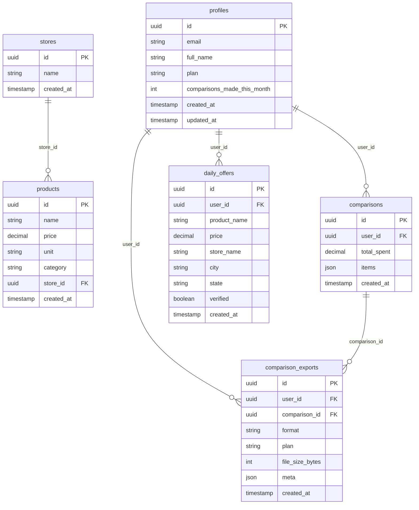
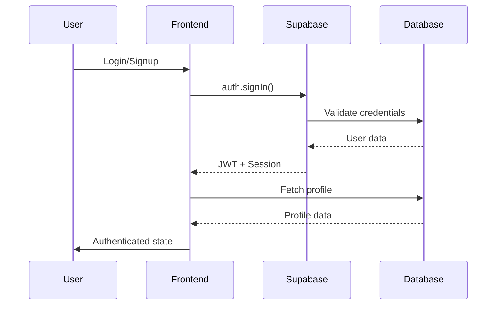
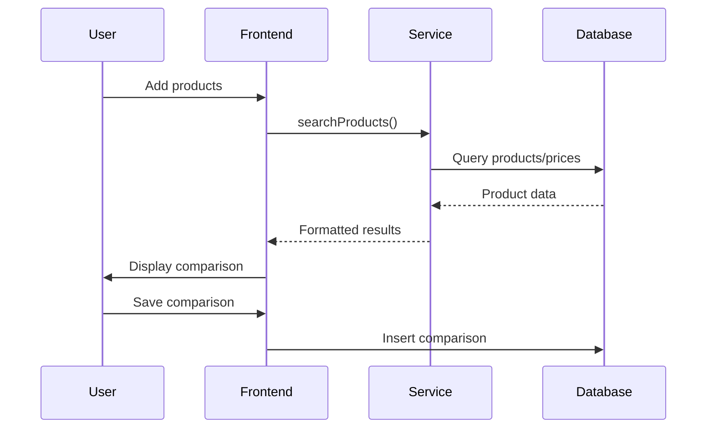
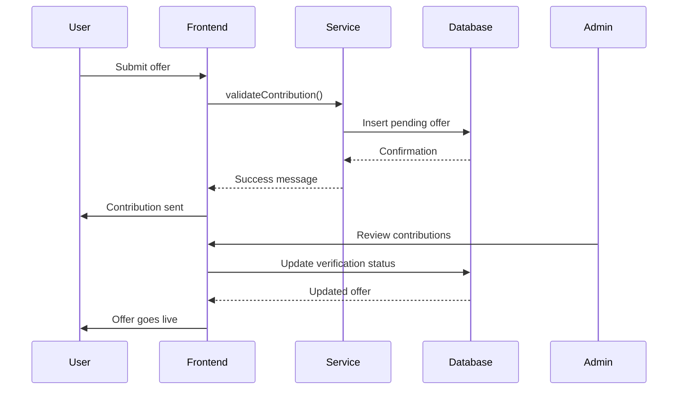
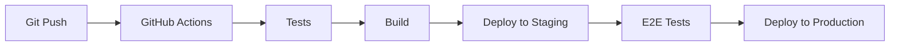
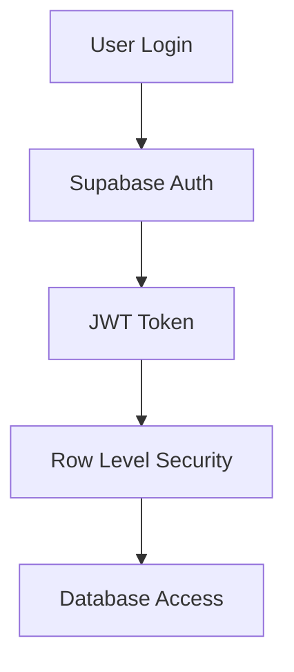

# 04 - Arquitetura do Sistema

## 🏗️ Visão Geral da Arquitetura

```mermaid
graph TB
    subgraph "Frontend (React PWA)"
        A[React App] --> B[Components]
        A --> C[Pages]
        A --> D[Services]
        A --> E[Hooks]
        B --> F[UI Components]
        B --> G[Business Components]
    end
    
    subgraph "Backend (Supabase)"
        H[Supabase Auth] --> I[PostgreSQL]
        J[Edge Functions] --> I
        K[Storage] --> I
        L[Realtime] --> I
    end
    
    subgraph "External Services"
        M[Payment (Stripe)]
        N[Push Notifications]
        O[Analytics]
    end
    
    D --> H
    D --> J
    D --> K
    J --> M
    J --> N
    A --> O
```

## 🎯 Arquitetura Frontend

### Estrutura de Pastas

```
src/
├── components/           # Componentes reutilizáveis
│   ├── ui/              # Componentes de UI (shadcn)
│   ├── admin/           # Componentes específicos do admin
│   ├── daily-offers/    # Componentes de ofertas diárias
│   └── ...              # Outros componentes específicos
├── pages/               # Páginas da aplicação
├── hooks/               # Custom hooks
├── services/            # Camada de serviços/API
│   ├── supabase/        # Serviços do Supabase
│   ├── daily-offers/    # Serviços de ofertas
│   └── ...              # Outros serviços
├── lib/                 # Utilitários e configurações
├── integrations/        # Integrações externas
└── assets/             # Assets estáticos
```

### Padrões Arquiteturais

#### 1. **Component-Based Architecture**
- Componentes funcionais com React Hooks
- Separação clara entre UI e lógica de negócio
- Reutilização através de composição

#### 2. **Service Layer Pattern**
- Abstração das chamadas de API
- Centralização da lógica de dados
- Facilita testes e manutenção

#### 3. **Custom Hooks Pattern**
- Encapsulamento de lógica de estado
- Reutilização de comportamentos
- Separação de concerns

#### 4. **Provider Pattern**
- Context API para estado global
- Gerenciamento de tema e autenticação
- Evita prop drilling

## 🗄️ Arquitetura Backend (Supabase)

### Database Schema



### Row Level Security (RLS) Policies

#### profiles
```sql
-- Users can read their own profile
CREATE POLICY "Users can read own profile" ON profiles
FOR SELECT USING (auth.uid() = id);

-- Users can update their own profile (with restrictions)
CREATE POLICY "Users can update own profile" ON profiles
FOR UPDATE USING (auth.uid() = id);
```

#### daily_offers
```sql
-- Anyone can read verified offers
CREATE POLICY "Anyone can read verified offers" ON daily_offers
FOR SELECT USING (verified = true);

-- Users can create their own offers
CREATE POLICY "Users can create offers" ON daily_offers
FOR INSERT WITH CHECK (auth.uid() = user_id);
```

### Edge Functions

#### 1. **create-checkout**
```typescript
// Cria sessão de checkout no Stripe
POST /functions/v1/create-checkout
{
  "priceId": "price_xxx",
  "customerId": "cus_xxx"
}
```

#### 2. **notify-user**
```typescript
// Envia notificações push
POST /functions/v1/notify-user
{
  "userId": "uuid",
  "title": "string",
  "body": "string"
}
```

#### 3. **check-subscription**
```typescript
// Verifica status da assinatura
GET /functions/v1/check-subscription
Headers: { Authorization: "Bearer token" }
```

## 🔄 Fluxo de Dados

### Fluxo de Autenticação



### Fluxo de Comparação



### Fluxo de Contribuição



## 📱 PWA Architecture

### Service Worker Strategy

```javascript
// Cache Strategy: Network First with Fallback
self.addEventListener('fetch', (event) => {
  if (event.request.url.includes('/api/')) {
    // API calls: Network first
    event.respondWith(networkFirstStrategy(event.request));
  } else {
    // Static assets: Cache first
    event.respondWith(cacheFirstStrategy(event.request));
  }
});
```

### Offline Storage

```typescript
// IndexedDB para dados offline
interface OfflineData {
  comparisons: Comparison[];
  contributions: PriceContribution[];
  products: Product[];
  lastSync: Date;
}
```

### Sync Strategy

```typescript
// Sincronização quando volta online
export const syncOfflineData = async () => {
  const offlineData = await getOfflineData();
  
  // Sync contributions
  for (const contribution of offlineData.contributions) {
    await supabase.from('daily_offers').insert(contribution);
  }
  
  // Sync comparisons
  for (const comparison of offlineData.comparisons) {
    await supabase.from('comparisons').insert(comparison);
  }
  
  // Clear synced data
  await clearSyncedData();
};
```

## 🔧 Tecnologias e Stack

### Frontend Stack
- **React 18** - UI Framework
- **TypeScript** - Type safety
- **Vite** - Build tool e dev server
- **Tailwind CSS** - Styling framework
- **shadcn/ui** - Component library
- **React Query** - Data fetching e cache
- **React Router** - Client-side routing
- **React Hook Form** - Form management
- **Zod** - Schema validation

### Backend Stack
- **Supabase** - Backend as a Service
- **PostgreSQL** - Database
- **PostgREST** - Auto-generated API
- **GoTrue** - Authentication
- **Realtime** - WebSocket connections
- **Edge Functions** - Serverless functions

### External Integrations
- **Stripe** - Payment processing
- **Web Push API** - Push notifications
- **Vercel** - Hosting e deployment
- **GitHub Actions** - CI/CD pipeline

## 🚀 Deployment Architecture

### Environment Setup

```yaml
# Development
VITE_SUPABASE_URL: http://localhost:54321
VITE_SUPABASE_ANON_KEY: eyJ...local

# Staging
VITE_SUPABASE_URL: https://staging.supabase.co
VITE_SUPABASE_ANON_KEY: eyJ...staging

# Production
VITE_SUPABASE_URL: https://diqdsmrlhldanxxrtozl.supabase.co
VITE_SUPABASE_ANON_KEY: eyJ...production
```

### CI/CD Pipeline



### Monitoring e Observability

#### Application Monitoring
- **Supabase Dashboard** - Database metrics
- **Vercel Analytics** - Performance metrics
- **Sentry** - Error tracking (planejado)
- **LogRocket** - Session replay (planejado)

#### Performance Metrics
- **Core Web Vitals** - LCP, FID, CLS
- **Bundle Size** - JavaScript payload
- **API Response Time** - Database queries
- **Cache Hit Rate** - Service worker cache

## 🔒 Security Architecture

### Authentication Flow


### Security Layers
1. **Transport Security** - HTTPS em todas as conexões
2. **Authentication** - JWT tokens com refresh
3. **Authorization** - RLS policies no banco
4. **Input Validation** - Zod schemas
5. **Content Security** - CSP headers
6. **Rate Limiting** - Supabase built-in limits

### Data Privacy
- **LGPD Compliance** - Consent management
- **Data Encryption** - At rest e in transit
- **Audit Logs** - Tracking de mudanças sensíveis
- **Data Retention** - Políticas de retenção

## 📈 Scalability Considerations

### Database Scaling
- **Read Replicas** - Para queries read-heavy
- **Connection Pooling** - PgBouncer
- **Query Optimization** - Indexes e performance
- **Data Archiving** - Dados históricos

### Frontend Scaling
- **Code Splitting** - Lazy loading de rotas
- **Image Optimization** - WebP e lazy loading
- **CDN** - Static assets via Vercel CDN
- **Bundle Optimization** - Tree shaking

### Performance Targets
- **First Load** < 3s
- **Time to Interactive** < 5s
- **API Response** < 500ms
- **Cache Hit Rate** > 80%