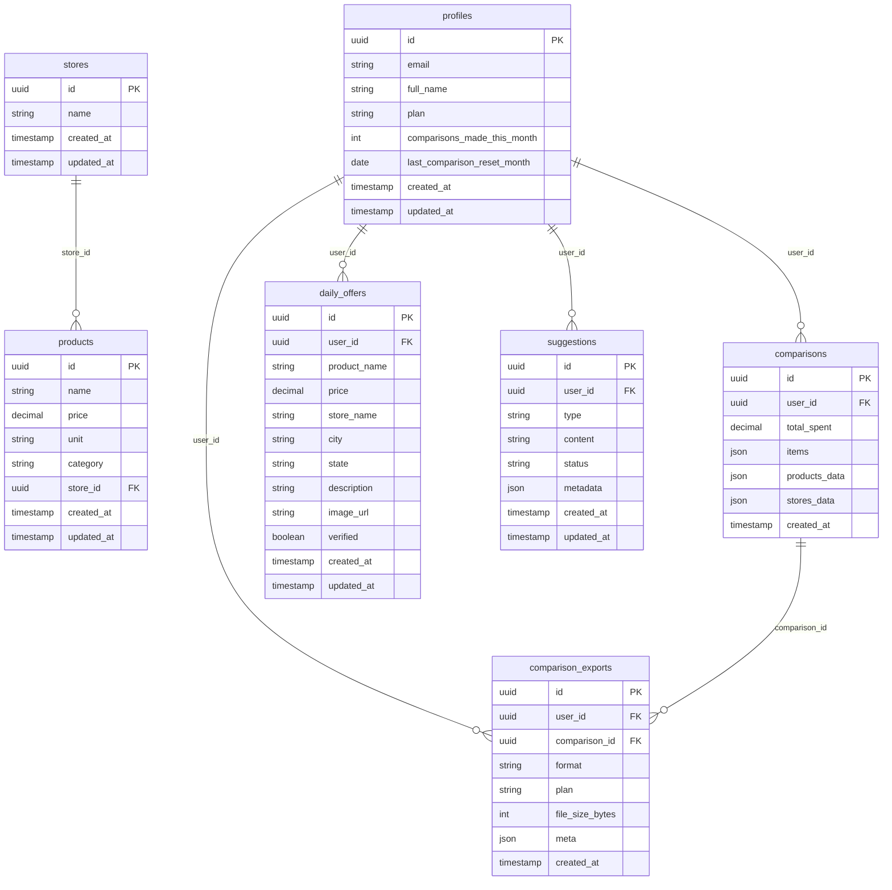

# 05 - Modelo de Dados

## 🗄️ Visão Geral do Schema

O banco de dados PostgreSQL do Supabase é estruturado para suportar todas as funcionalidades do sistema de comparação de preços, mantendo integridade referencial e performance otimizada.



## 📊 Tabelas Principais

### 1. profiles
**Descrição**: Informações dos usuários da plataforma

```sql
CREATE TABLE profiles (
  id UUID REFERENCES auth.users(id) PRIMARY KEY,
  email TEXT UNIQUE NOT NULL,
  full_name TEXT,
  plan TEXT NOT NULL DEFAULT 'free' CHECK (plan IN ('free', 'premium', 'pro', 'admin')),
  comparisons_made_this_month INTEGER DEFAULT 0,
  last_comparison_reset_month DATE DEFAULT CURRENT_DATE,
  created_at TIMESTAMP WITH TIME ZONE DEFAULT NOW(),
  updated_at TIMESTAMP WITH TIME ZONE DEFAULT NOW()
);
```

**Campos importantes**:
- `plan`: Define o nível de acesso do usuário
- `comparisons_made_this_month`: Controla limites por plano
- `last_comparison_reset_month`: Para reset automático dos limites

**Indexes**:
```sql
CREATE INDEX idx_profiles_plan ON profiles(plan);
CREATE INDEX idx_profiles_email ON profiles(email);
```

**RLS Policies**:
```sql
-- Usuários podem ler seu próprio perfil
CREATE POLICY "Users can read own profile" ON profiles
FOR SELECT USING (auth.uid() = id);

-- Usuários podem atualizar seu próprio perfil (com restrições)
CREATE POLICY "Users can update own profile" ON profiles
FOR UPDATE USING (auth.uid() = id);
```

---

### 2. stores
**Descrição**: Estabelecimentos comerciais

```sql
CREATE TABLE stores (
  id UUID DEFAULT gen_random_uuid() PRIMARY KEY,
  name TEXT NOT NULL,
  created_at TIMESTAMP WITH TIME ZONE DEFAULT NOW(),
  updated_at TIMESTAMP WITH TIME ZONE DEFAULT NOW()
);
```

**Características**:
- Nome único por estabelecimento
- Referenciado por produtos e ofertas
- Dados básicos para simplicidade

**RLS Policies**:
```sql
-- Todos podem ler lojas
CREATE POLICY "Anyone can read stores" ON stores
FOR SELECT TO authenticated, anon USING (true);
```

---

### 3. products
**Descrição**: Produtos disponíveis nos estabelecimentos

```sql
CREATE TABLE products (
  id UUID DEFAULT gen_random_uuid() PRIMARY KEY,
  name TEXT NOT NULL,
  price DECIMAL(10,2) NOT NULL,
  unit TEXT NOT NULL DEFAULT 'un',
  category TEXT,
  store_id UUID REFERENCES stores(id) ON DELETE CASCADE,
  created_at TIMESTAMP WITH TIME ZONE DEFAULT NOW(),
  updated_at TIMESTAMP WITH TIME ZONE DEFAULT NOW()
);
```

**Campos importantes**:
- `price`: Preço atual do produto
- `unit`: Unidade de medida (kg, L, un, etc.)
- `category`: Categoria para filtros e organização

**Indexes**:
```sql
CREATE INDEX idx_products_name ON products(name);
CREATE INDEX idx_products_category ON products(category);
CREATE INDEX idx_products_store_id ON products(store_id);
CREATE INDEX idx_products_price ON products(price);
```

**RLS Policies**:
```sql
-- Todos podem ler produtos
CREATE POLICY "Anyone can read products" ON products
FOR SELECT TO authenticated, anon USING (true);
```

---

### 4. comparisons
**Descrição**: Comparações realizadas pelos usuários

```sql
CREATE TABLE comparisons (
  id UUID DEFAULT gen_random_uuid() PRIMARY KEY,
  user_id UUID REFERENCES auth.users(id) ON DELETE CASCADE,
  total_spent DECIMAL(10,2) NOT NULL DEFAULT 0,
  items JSONB NOT NULL DEFAULT '[]'::jsonb,
  products_data JSONB DEFAULT '{}'::jsonb,
  stores_data JSONB DEFAULT '{}'::jsonb,
  created_at TIMESTAMP WITH TIME ZONE DEFAULT NOW()
);
```

**Estrutura do JSON `items`**:
```typescript
interface ComparisonItem {
  id: string;
  productName: string;
  quantity: number;
  unit: string;
  category?: string;
  prices: {
    [storeId: string]: {
      price: number;
      storeName: string;
    }
  };
}
```

**Indexes**:
```sql
CREATE INDEX idx_comparisons_user_id ON comparisons(user_id);
CREATE INDEX idx_comparisons_created_at ON comparisons(created_at);
CREATE INDEX idx_comparisons_items ON comparisons USING GIN(items);
```

**RLS Policies**:
```sql
-- Usuários podem ler suas próprias comparações
CREATE POLICY "Users can read own comparisons" ON comparisons
FOR SELECT USING (auth.uid() = user_id);

-- Usuários podem criar comparações
CREATE POLICY "Users can create comparisons" ON comparisons
FOR INSERT WITH CHECK (auth.uid() = user_id);
```

---

### 5. daily_offers
**Descrição**: Ofertas diárias contribuídas pelos usuários

```sql
CREATE TABLE daily_offers (
  id UUID DEFAULT gen_random_uuid() PRIMARY KEY,
  user_id UUID REFERENCES auth.users(id) ON DELETE CASCADE,
  product_name TEXT NOT NULL,
  price DECIMAL(10,2) NOT NULL,
  store_name TEXT NOT NULL,
  city TEXT NOT NULL,
  state TEXT NOT NULL DEFAULT 'SP',
  description TEXT,
  image_url TEXT,
  verified BOOLEAN DEFAULT false,
  created_at TIMESTAMP WITH TIME ZONE DEFAULT NOW(),
  updated_at TIMESTAMP WITH TIME ZONE DEFAULT NOW()
);
```

**Campos importantes**:
- `verified`: Indica se a oferta foi aprovada por admin
- `city/state`: Localização para filtros geográficos
- `image_url`: Foto da oferta (opcional)

**Indexes**:
```sql
CREATE INDEX idx_daily_offers_verified ON daily_offers(verified);
CREATE INDEX idx_daily_offers_city ON daily_offers(city);
CREATE INDEX idx_daily_offers_created_at ON daily_offers(created_at);
CREATE INDEX idx_daily_offers_user_id ON daily_offers(user_id);
```

**RLS Policies**:
```sql
-- Todos podem ler ofertas verificadas
CREATE POLICY "Anyone can read verified offers" ON daily_offers
FOR SELECT USING (verified = true);

-- Usuários podem ler suas próprias ofertas
CREATE POLICY "Users can read own offers" ON daily_offers
FOR SELECT USING (auth.uid() = user_id);

-- Usuários podem criar ofertas
CREATE POLICY "Users can create offers" ON daily_offers
FOR INSERT WITH CHECK (auth.uid() = user_id);
```

---

### 6. comparison_exports
**Descrição**: Log de exportações de comparações

```sql
CREATE TABLE comparison_exports (
  id UUID DEFAULT gen_random_uuid() PRIMARY KEY,
  user_id UUID REFERENCES auth.users(id) ON DELETE CASCADE,
  comparison_id UUID REFERENCES comparisons(id) ON DELETE CASCADE,
  format TEXT NOT NULL CHECK (format IN ('pdf', 'csv', 'excel')),
  plan TEXT NOT NULL,
  file_size_bytes INTEGER,
  meta JSONB DEFAULT '{}'::jsonb,
  created_at TIMESTAMP WITH TIME ZONE DEFAULT NOW()
);
```

**Finalidade**:
- Controle de uso de funcionalidades premium
- Analytics de utilização
- Auditoria de exports

---

### 7. suggestions
**Descrição**: Sugestões e feedback dos usuários

```sql
CREATE TABLE suggestions (
  id UUID DEFAULT gen_random_uuid() PRIMARY KEY,
  user_id UUID REFERENCES auth.users(id) ON DELETE CASCADE,
  type TEXT NOT NULL CHECK (type IN ('feature', 'bug', 'improvement', 'other')),
  content TEXT NOT NULL,
  status TEXT DEFAULT 'pending' CHECK (status IN ('pending', 'in_progress', 'completed', 'rejected')),
  metadata JSONB DEFAULT '{}'::jsonb,
  created_at TIMESTAMP WITH TIME ZONE DEFAULT NOW(),
  updated_at TIMESTAMP WITH TIME ZONE DEFAULT NOW()
);
```

## 🔄 Triggers e Funções

### 1. Atualização Automática de `updated_at`

```sql
CREATE OR REPLACE FUNCTION update_updated_at_column()
RETURNS TRIGGER AS $$
BEGIN
  NEW.updated_at = NOW();
  RETURN NEW;
END;
$$ LANGUAGE plpgsql;

-- Aplicar trigger nas tabelas necessárias
CREATE TRIGGER update_profiles_updated_at
  BEFORE UPDATE ON profiles
  FOR EACH ROW EXECUTE FUNCTION update_updated_at_column();
```

### 2. Reset de Contadores Mensais

```sql
CREATE OR REPLACE FUNCTION reset_monthly_comparisons()
RETURNS TRIGGER AS $$
BEGIN
  -- Reset contador se mudou o mês
  IF EXTRACT(MONTH FROM NEW.last_comparison_reset_month) != EXTRACT(MONTH FROM CURRENT_DATE) 
     OR EXTRACT(YEAR FROM NEW.last_comparison_reset_month) != EXTRACT(YEAR FROM CURRENT_DATE) THEN
    NEW.comparisons_made_this_month := 0;
    NEW.last_comparison_reset_month := CURRENT_DATE;
  END IF;
  
  RETURN NEW;
END;
$$ LANGUAGE plpgsql;
```

### 3. Limpeza Automática de Ofertas Antigas

```sql
-- Função para limpar ofertas antigas
CREATE OR REPLACE FUNCTION cleanup_old_offers()
RETURNS void AS $$
BEGIN
  DELETE FROM daily_offers 
  WHERE created_at < NOW() - INTERVAL '30 days' 
    AND verified = false;
END;
$$ LANGUAGE plpgsql;

-- Trigger automático via cron (se disponível)
SELECT cron.schedule('cleanup-offers', '0 2 * * *', 'SELECT cleanup_old_offers();');
```

### 4. Verificação de Admin

```sql
CREATE OR REPLACE FUNCTION is_user_admin()
RETURNS boolean
LANGUAGE sql
STABLE SECURITY DEFINER
SET search_path TO 'public'
AS $$
  SELECT COALESCE(
    (SELECT true 
     FROM auth.users 
     WHERE id = auth.uid()
       AND email IN ('mariorenan25@gmail.com', 'mariovendasonline10k@gmail.com')
     LIMIT 1), 
    false
  );
$$;
```

## 📈 Estratégia de Performance

### Indexes Principais

```sql
-- Performance em buscas de produtos
CREATE INDEX idx_products_search ON products 
USING gin(to_tsvector('portuguese', name));

-- Performance em comparações por usuário
CREATE INDEX idx_comparisons_user_date ON comparisons(user_id, created_at DESC);

-- Performance em ofertas por localização
CREATE INDEX idx_offers_location ON daily_offers(city, state) 
WHERE verified = true;

-- Performance em analytics
CREATE INDEX idx_exports_analytics ON comparison_exports(created_at, format, plan);
```

### Views Otimizadas

```sql
-- View para ofertas ativas
CREATE VIEW active_offers AS
SELECT 
  id,
  product_name,
  price,
  store_name,
  city,
  state,
  created_at
FROM daily_offers 
WHERE verified = true 
  AND created_at > NOW() - INTERVAL '7 days'
ORDER BY created_at DESC;

-- View para estatísticas de usuário
CREATE VIEW user_stats AS
SELECT 
  u.id,
  u.full_name,
  u.plan,
  COUNT(DISTINCT c.id) as total_comparisons,
  COUNT(DISTINCT d.id) as total_contributions,
  COUNT(DISTINCT e.id) as total_exports
FROM profiles u
LEFT JOIN comparisons c ON u.id = c.user_id
LEFT JOIN daily_offers d ON u.id = d.user_id
LEFT JOIN comparison_exports e ON u.id = e.user_id
GROUP BY u.id, u.full_name, u.plan;
```

## 🔒 Segurança dos Dados

### Políticas RLS Avançadas

```sql
-- Admin pode ver tudo
CREATE POLICY "Admins can see everything" ON daily_offers
FOR SELECT TO authenticated
USING (is_user_admin());

-- Limit de comparações por plano
CREATE OR REPLACE FUNCTION check_comparison_limit()
RETURNS boolean AS $$
DECLARE
  user_plan TEXT;
  current_count INTEGER;
  plan_limit INTEGER;
BEGIN
  SELECT plan, comparisons_made_this_month 
  INTO user_plan, current_count
  FROM profiles 
  WHERE id = auth.uid();
  
  plan_limit := CASE user_plan
    WHEN 'free' THEN 10
    WHEN 'premium' THEN 100
    WHEN 'pro' THEN 1000
    WHEN 'admin' THEN 999999
    ELSE 0
  END;
  
  RETURN current_count < plan_limit;
END;
$$ LANGUAGE plpgsql SECURITY DEFINER;
```

### Auditoria e Logs

```sql
-- Tabela de auditoria
CREATE TABLE audit_log (
  id UUID DEFAULT gen_random_uuid() PRIMARY KEY,
  table_name TEXT NOT NULL,
  operation TEXT NOT NULL,
  user_id UUID REFERENCES auth.users(id),
  old_data JSONB,
  new_data JSONB,
  created_at TIMESTAMP WITH TIME ZONE DEFAULT NOW()
);

-- Trigger de auditoria para tabelas sensíveis
CREATE OR REPLACE FUNCTION audit_trigger()
RETURNS TRIGGER AS $$
BEGIN
  INSERT INTO audit_log (table_name, operation, user_id, old_data, new_data)
  VALUES (
    TG_TABLE_NAME,
    TG_OP,
    auth.uid(),
    CASE WHEN TG_OP = 'DELETE' THEN row_to_json(OLD) ELSE NULL END,
    CASE WHEN TG_OP IN ('INSERT', 'UPDATE') THEN row_to_json(NEW) ELSE NULL END
  );
  
  RETURN COALESCE(NEW, OLD);
END;
$$ LANGUAGE plpgsql;
```

## 📊 Métricas e Analytics

### Queries Comuns para Analytics

```sql
-- Usuários ativos por mês
SELECT 
  DATE_TRUNC('month', created_at) as month,
  COUNT(*) as active_users
FROM comparisons 
WHERE created_at >= NOW() - INTERVAL '12 months'
GROUP BY month
ORDER BY month;

-- Produtos mais comparados
SELECT 
  jsonb_array_elements(items)->>'productName' as product,
  COUNT(*) as comparison_count
FROM comparisons 
WHERE created_at >= NOW() - INTERVAL '30 days'
GROUP BY product
ORDER BY comparison_count DESC
LIMIT 20;

-- Taxa de conversão para premium
SELECT 
  plan,
  COUNT(*) as user_count,
  ROUND(COUNT(*) * 100.0 / SUM(COUNT(*)) OVER (), 2) as percentage
FROM profiles 
GROUP BY plan;
```

## 🔄 Migração e Versionamento

### Estratégia de Migração
1. **Versionamento de Schema** - Cada alteração tem timestamp
2. **Rollback Safe** - Migrations podem ser revertidas
3. **Zero Downtime** - Alterações não bloqueantes
4. **Data Integrity** - Validações antes e depois

### Exemplo de Migration

```sql
-- Migration: 20240126_add_image_to_offers.sql
BEGIN;

-- Adicionar coluna para imagens
ALTER TABLE daily_offers 
ADD COLUMN image_url TEXT;

-- Índice para performance
CREATE INDEX CONCURRENTLY idx_daily_offers_image 
ON daily_offers(image_url) 
WHERE image_url IS NOT NULL;

-- Atualizar RLS se necessário
-- (políticas existentes já cobrem a nova coluna)

COMMIT;
```

## 📋 Validações e Constraints

### Constraints de Negócio

```sql
-- Preços devem ser positivos
ALTER TABLE products 
ADD CONSTRAINT check_positive_price CHECK (price > 0);

ALTER TABLE daily_offers 
ADD CONSTRAINT check_positive_price CHECK (price > 0);

-- Planos válidos
ALTER TABLE profiles 
ADD CONSTRAINT check_valid_plan 
CHECK (plan IN ('free', 'premium', 'pro', 'admin'));

-- Estados válidos (brasileiros)
ALTER TABLE daily_offers 
ADD CONSTRAINT check_valid_state 
CHECK (state IN ('AC', 'AL', 'AP', 'AM', 'BA', 'CE', 'DF', 'ES', 'GO', 'MA', 'MT', 'MS', 'MG', 'PA', 'PB', 'PR', 'PE', 'PI', 'RJ', 'RN', 'RS', 'RO', 'RR', 'SC', 'SP', 'SE', 'TO'));
```

### Validações de Aplicação

```typescript
// Schemas Zod para validação no frontend
export const ProductSchema = z.object({
  name: z.string().min(2).max(100),
  price: z.number().positive(),
  unit: z.string().min(1).max(10),
  category: z.string().optional(),
});

export const DailyOfferSchema = z.object({
  productName: z.string().min(2).max(100),
  price: z.number().positive(),
  storeName: z.string().min(2).max(50),
  city: z.string().min(2).max(50),
  state: z.string().length(2),
  description: z.string().max(500).optional(),
});
```