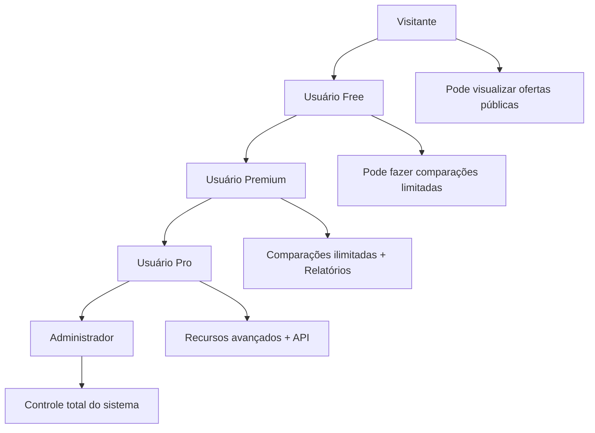
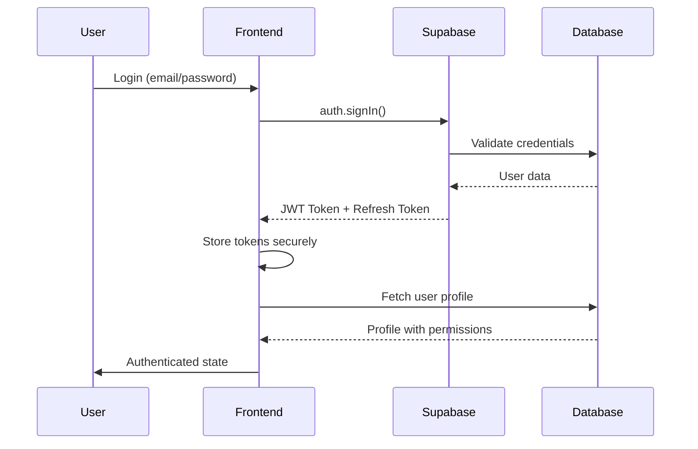

# 06 - Segurança e Permissões

## 🔐 Visão Geral de Segurança

O sistema implementa múltiplas camadas de segurança para proteger dados dos usuários e garantir acesso apropriado às funcionalidades, seguindo princípios de **Defense in Depth** e **Zero Trust**.

## 🎭 Modelo de Permissões

### Hierarquia de Usuários



### Matrix de Permissões

| Recurso | Visitante | Free | Premium | Pro | Admin |
|---------|-----------|------|---------|-----|-------|
| **Visualizar ofertas** | ✅ | ✅ | ✅ | ✅ | ✅ |
| **Fazer comparações** | ❌ | ✅ (10/mês) | ✅ (100/mês) | ✅ (1000/mês) | ✅ (Ilimitado) |
| **Contribuir ofertas** | ❌ | ✅ | ✅ | ✅ | ✅ |
| **Exportar PDF** | ❌ | ❌ | ✅ | ✅ | ✅ |
| **Relatórios mensais** | ❌ | ❌ | ✅ | ✅ | ✅ |
| **API Access** | ❌ | ❌ | ❌ | ✅ | ✅ |
| **Moderação** | ❌ | ❌ | ❌ | ❌ | ✅ |
| **Analytics** | ❌ | ❌ | ❌ | ❌ | ✅ |
| **Gestão de usuários** | ❌ | ❌ | ❌ | ❌ | ✅ |

## 🛡️ Camadas de Segurança

### 1. Transport Layer Security
```
┌─────────────────────┐
│   HTTPS/TLS 1.3     │  ← Criptografia em trânsito
├─────────────────────┤
│   CDN Security      │  ← DDoS protection, WAF
├─────────────────────┤
│   Load Balancer     │  ← Rate limiting
└─────────────────────┘
```

### 2. Application Security
```
┌─────────────────────┐
│   Input Validation  │  ← Zod schemas, sanitização
├─────────────────────┤
│   Authentication    │  ← JWT, OAuth, MFA
├─────────────────────┤
│   Authorization     │  ← Role-based access
├─────────────────────┤
│   Session Management│  ← Secure sessions
└─────────────────────┘
```

### 3. Database Security
```
┌─────────────────────┐
│   Row Level Security│  ← RLS policies
├─────────────────────┤
│   Encryption at Rest│  ← Database encryption
├─────────────────────┤
│   Backup Encryption │  ← Encrypted backups
├─────────────────────┤
│   Audit Logging     │  ← Activity tracking
└─────────────────────┘
```

## 🔑 Sistema de Autenticação

### Fluxo de Autenticação



### Implementação de JWT

```typescript
// Token structure
interface JWTPayload {
  sub: string;           // User ID
  email: string;         // User email
  role: string;          // Database role
  exp: number;           // Expiration time
  iat: number;           // Issued at
  aud: string;           // Audience (supabase)
  iss: string;           // Issuer (supabase)
}

// Token validation
export const validateToken = async (token: string): Promise<boolean> => {
  try {
    const { data, error } = await supabase.auth.getUser(token);
    return !error && !!data.user;
  } catch {
    return false;
  }
};
```

### Refresh Token Strategy

```typescript
// Auto-refresh implementation
export const setupTokenRefresh = () => {
  supabase.auth.onAuthStateChange((event, session) => {
    if (event === 'TOKEN_REFRESHED') {
      console.log('Token refreshed automatically');
    }
    
    if (event === 'SIGNED_OUT') {
      // Clear local storage
      localStorage.removeItem('user-data');
    }
  });
};
```

## 🔐 Row Level Security (RLS)

### Políticas Principais

#### 1. Profiles Table
```sql
-- Usuários podem ver apenas seu próprio perfil
CREATE POLICY "Users can read own profile" ON profiles
FOR SELECT USING (auth.uid() = id);

-- Usuários podem atualizar apenas campos permitidos
CREATE POLICY "Users can update own profile" ON profiles
FOR UPDATE USING (
  auth.uid() = id AND
  -- Bloquear campos sensíveis
  OLD.plan = NEW.plan AND
  OLD.comparisons_made_this_month = NEW.comparisons_made_this_month
);

-- Função para permitir atualizações administrativas
CREATE OR REPLACE FUNCTION guard_profile_sensitive_update()
RETURNS trigger AS $$
BEGIN
  -- Allow admin emails to have admin plan
  IF NEW.email IN ('mariorenan25@gmail.com', 'mariovendasonline10k@gmail.com') THEN
    NEW.plan := 'admin';
    RETURN NEW;
  END IF;
  
  -- Block sensitive field changes for regular users
  IF NEW.plan IS DISTINCT FROM OLD.plan
     OR NEW.comparisons_made_this_month IS DISTINCT FROM OLD.comparisons_made_this_month THEN
    RAISE EXCEPTION 'Insufficient privileges';
  END IF;
  
  RETURN NEW;
END;
$$ LANGUAGE plpgsql SECURITY DEFINER;
```

#### 2. Daily Offers Table
```sql
-- Todos podem ver ofertas verificadas
CREATE POLICY "Anyone can read verified offers" ON daily_offers
FOR SELECT USING (verified = true);

-- Usuários podem ver suas próprias ofertas (verificadas ou não)
CREATE POLICY "Users can read own offers" ON daily_offers
FOR SELECT USING (auth.uid() = user_id);

-- Usuários podem criar ofertas
CREATE POLICY "Users can create offers" ON daily_offers
FOR INSERT WITH CHECK (auth.uid() = user_id);

-- Apenas admins podem atualizar status de verificação
CREATE POLICY "Admins can verify offers" ON daily_offers
FOR UPDATE USING (is_user_admin())
WITH CHECK (is_user_admin());
```

#### 3. Comparisons Table
```sql
-- Usuários podem ver apenas suas comparações
CREATE POLICY "Users can read own comparisons" ON comparisons
FOR SELECT USING (auth.uid() = user_id);

-- Usuários podem criar comparações (com limite)
CREATE POLICY "Users can create comparisons" ON comparisons
FOR INSERT WITH CHECK (
  auth.uid() = user_id AND
  check_comparison_limit()
);

-- Função para verificar limite de comparações
CREATE OR REPLACE FUNCTION check_comparison_limit()
RETURNS boolean AS $$
DECLARE
  user_plan TEXT;
  current_count INTEGER;
  plan_limit INTEGER;
BEGIN
  SELECT plan, comparisons_made_this_month 
  INTO user_plan, current_count
  FROM profiles 
  WHERE id = auth.uid();
  
  plan_limit := CASE user_plan
    WHEN 'free' THEN 10
    WHEN 'premium' THEN 100
    WHEN 'pro' THEN 1000
    WHEN 'admin' THEN 999999
    ELSE 0
  END;
  
  RETURN current_count < plan_limit;
END;
$$ LANGUAGE plpgsql SECURITY DEFINER;
```

### Funções de Segurança

#### Verificação de Admin
```sql
CREATE OR REPLACE FUNCTION is_user_admin()
RETURNS boolean
LANGUAGE sql
STABLE SECURITY DEFINER
SET search_path TO 'public'
AS $$
  SELECT COALESCE(
    (SELECT true 
     FROM auth.users 
     WHERE id = auth.uid()
       AND email IN ('mariorenan25@gmail.com', 'mariovendasonline10k@gmail.com')
     LIMIT 1), 
    false
  );
$$;

-- Função pública para verificar admin por UUID
CREATE OR REPLACE FUNCTION check_user_admin_status(user_uuid uuid DEFAULT auth.uid())
RETURNS boolean
LANGUAGE sql
STABLE SECURITY DEFINER
SET search_path TO 'public'
AS $$
  SELECT COALESCE(
    (SELECT true 
     FROM auth.users 
     WHERE id = COALESCE(user_uuid, auth.uid())
       AND email IN ('mariorenan25@gmail.com', 'mariovendasonline10k@gmail.com')
     LIMIT 1), 
    false
  );
$$;
```

## 🛡️ Validação de Input

### Frontend Validation (Zod)

```typescript
// Esquemas de validação
export const PriceContributionSchema = z.object({
  productName: z.string()
    .min(2, "Nome deve ter pelo menos 2 caracteres")
    .max(100, "Nome não pode exceder 100 caracteres")
    .regex(/^[a-zA-ZÀ-ÿ0-9\s\-\.]+$/, "Caracteres inválidos"),
  
  price: z.number()
    .positive("Preço deve ser positivo")
    .max(99999.99, "Preço muito alto"),
  
  storeName: z.string()
    .min(2, "Nome da loja obrigatório")
    .max(50, "Nome da loja muito longo"),
  
  city: z.string()
    .min(2, "Cidade obrigatória")
    .max(50, "Nome da cidade muito longo"),
  
  state: z.string()
    .length(2, "Estado deve ter 2 caracteres")
    .regex(/^[A-Z]{2}$/, "Estado inválido")
});

// Sanitização de dados
export const sanitizeInput = (input: string): string => {
  return input
    .trim()
    .replace(/[<>\"'&]/g, '') // Remove caracteres perigosos
    .substring(0, 1000); // Limita tamanho
};
```

### Backend Validation (PostgreSQL)

```sql
-- Constraints de banco de dados
ALTER TABLE daily_offers 
ADD CONSTRAINT check_positive_price CHECK (price > 0);

ALTER TABLE daily_offers 
ADD CONSTRAINT check_valid_state 
CHECK (state IN ('AC', 'AL', 'AP', 'AM', 'BA', 'CE', 'DF', 'ES', 'GO', 'MA', 'MT', 'MS', 'MG', 'PA', 'PB', 'PR', 'PE', 'PI', 'RJ', 'RN', 'RS', 'RO', 'RR', 'SC', 'SP', 'SE', 'TO'));

-- Função de validação de email
CREATE OR REPLACE FUNCTION validate_email(email TEXT)
RETURNS boolean AS $$
BEGIN
  RETURN email ~* '^[A-Za-z0-9._%+-]+@[A-Za-z0-9.-]+\.[A-Za-z]{2,}$';
END;
$$ LANGUAGE plpgsql;
```

## 🔍 Auditoria e Logging

### Sistema de Audit Log

```sql
-- Tabela de auditoria
CREATE TABLE audit_log (
  id UUID DEFAULT gen_random_uuid() PRIMARY KEY,
  table_name TEXT NOT NULL,
  operation TEXT NOT NULL CHECK (operation IN ('INSERT', 'UPDATE', 'DELETE')),
  user_id UUID REFERENCES auth.users(id),
  user_email TEXT,
  old_data JSONB,
  new_data JSONB,
  ip_address INET,
  user_agent TEXT,
  created_at TIMESTAMP WITH TIME ZONE DEFAULT NOW()
);

-- Função de auditoria
CREATE OR REPLACE FUNCTION audit_trigger()
RETURNS TRIGGER AS $$
DECLARE
  user_email TEXT;
BEGIN
  -- Buscar email do usuário
  SELECT email INTO user_email 
  FROM auth.users 
  WHERE id = auth.uid();
  
  INSERT INTO audit_log (
    table_name, 
    operation, 
    user_id, 
    user_email,
    old_data, 
    new_data,
    ip_address
  ) VALUES (
    TG_TABLE_NAME,
    TG_OP,
    auth.uid(),
    user_email,
    CASE WHEN TG_OP = 'DELETE' THEN row_to_json(OLD) ELSE NULL END,
    CASE WHEN TG_OP IN ('INSERT', 'UPDATE') THEN row_to_json(NEW) ELSE NULL END,
    inet_client_addr()
  );
  
  RETURN COALESCE(NEW, OLD);
END;
$$ LANGUAGE plpgsql;

-- Aplicar auditoria em tabelas críticas
CREATE TRIGGER audit_profiles_trigger
  AFTER INSERT OR UPDATE OR DELETE ON profiles
  FOR EACH ROW EXECUTE FUNCTION audit_trigger();

CREATE TRIGGER audit_daily_offers_trigger
  AFTER INSERT OR UPDATE OR DELETE ON daily_offers
  FOR EACH ROW EXECUTE FUNCTION audit_trigger();
```

### Logs de Segurança

```typescript
// Service de logging seguro
export class SecurityLogger {
  static async logSecurityEvent(event: {
    type: 'AUTH_FAIL' | 'PERMISSION_DENIED' | 'SUSPICIOUS_ACTIVITY';
    userId?: string;
    details: Record<string, any>;
    severity: 'LOW' | 'MEDIUM' | 'HIGH' | 'CRITICAL';
  }) {
    const logEntry = {
      timestamp: new Date().toISOString(),
      type: event.type,
      userId: event.userId,
      details: event.details,
      severity: event.severity,
      userAgent: navigator.userAgent,
      ip: await this.getClientIP(),
    };
    
    // Log para Supabase
    await supabase.from('security_logs').insert(logEntry);
    
    // Se crítico, alertar admins
    if (event.severity === 'CRITICAL') {
      await this.alertAdmins(logEntry);
    }
  }
  
  private static async getClientIP(): Promise<string> {
    try {
      const response = await fetch('https://api.ipify.org?format=json');
      const data = await response.json();
      return data.ip;
    } catch {
      return 'unknown';
    }
  }
}
```

## 🚨 Detecção de Ameaças

### Rate Limiting

```typescript
// Rate limiting por usuário
export class RateLimiter {
  private static limits = {
    comparisons: { count: 60, window: 60000 }, // 60 por minuto
    contributions: { count: 10, window: 60000 }, // 10 por minuto
    api_calls: { count: 1000, window: 3600000 }, // 1000 por hora
  };
  
  static async checkLimit(
    userId: string, 
    action: keyof typeof this.limits
  ): Promise<boolean> {
    const key = `rate_limit:${userId}:${action}`;
    const limit = this.limits[action];
    
    // Implementação com Redis ou localStorage
    const current = await this.getCurrentCount(key);
    
    if (current >= limit.count) {
      await SecurityLogger.logSecurityEvent({
        type: 'SUSPICIOUS_ACTIVITY',
        userId,
        details: { action, count: current, limit: limit.count },
        severity: 'MEDIUM'
      });
      return false;
    }
    
    await this.incrementCount(key, limit.window);
    return true;
  }
}
```

### Detecção de Anomalias

```sql
-- View para detectar atividades suspeitas
CREATE VIEW suspicious_activities AS
SELECT 
  user_id,
  user_email,
  COUNT(*) as activity_count,
  array_agg(DISTINCT operation) as operations,
  array_agg(DISTINCT table_name) as tables_affected,
  MIN(created_at) as first_activity,
  MAX(created_at) as last_activity
FROM audit_log 
WHERE created_at >= NOW() - INTERVAL '1 hour'
GROUP BY user_id, user_email
HAVING COUNT(*) > 100  -- Mais de 100 operações por hora
ORDER BY activity_count DESC;

-- Função para alertar sobre atividades suspeitas
CREATE OR REPLACE FUNCTION check_suspicious_activity()
RETURNS void AS $$
DECLARE
  suspicious_record RECORD;
BEGIN
  FOR suspicious_record IN SELECT * FROM suspicious_activities LOOP
    -- Inserir alerta
    INSERT INTO security_alerts (
      alert_type,
      user_id,
      details,
      severity,
      created_at
    ) VALUES (
      'HIGH_ACTIVITY',
      suspicious_record.user_id,
      json_build_object(
        'activity_count', suspicious_record.activity_count,
        'operations', suspicious_record.operations,
        'time_window', '1 hour'
      ),
      'HIGH',
      NOW()
    );
  END LOOP;
END;
$$ LANGUAGE plpgsql;
```

## 🔒 Proteção de Dados Sensíveis

### Criptografia

```typescript
// Utilitário para criptografia de dados sensíveis
import CryptoJS from 'crypto-js';

export class DataEncryption {
  private static readonly SECRET_KEY = process.env.VITE_ENCRYPTION_KEY;
  
  static encrypt(data: string): string {
    return CryptoJS.AES.encrypt(data, this.SECRET_KEY).toString();
  }
  
  static decrypt(encryptedData: string): string {
    const bytes = CryptoJS.AES.decrypt(encryptedData, this.SECRET_KEY);
    return bytes.toString(CryptoJS.enc.Utf8);
  }
  
  // Para dados de cartão (se implementado)
  static encryptSensitiveData(data: {
    cardNumber?: string;
    cvv?: string;
    [key: string]: any;
  }): any {
    const encrypted = { ...data };
    
    if (encrypted.cardNumber) {
      encrypted.cardNumber = this.encrypt(encrypted.cardNumber);
    }
    
    if (encrypted.cvv) {
      encrypted.cvv = this.encrypt(encrypted.cvv);
    }
    
    return encrypted;
  }
}
```

### Anonização de Dados

```sql
-- Função para anonizar dados de usuários inativos
CREATE OR REPLACE FUNCTION anonymize_inactive_users()
RETURNS void AS $$
BEGIN
  UPDATE profiles 
  SET 
    email = 'anonymized_' || id || '@deleted.local',
    full_name = 'Usuário Removido'
  WHERE 
    id IN (
      SELECT p.id 
      FROM profiles p
      LEFT JOIN comparisons c ON p.id = c.user_id
      WHERE c.created_at IS NULL 
         OR c.created_at < NOW() - INTERVAL '2 years'
    )
    AND email NOT LIKE 'anonymized_%';
END;
$$ LANGUAGE plpgsql;
```

## 🛡️ Compliance e Regulamentações

### LGPD (Lei Geral de Proteção de Dados)

#### Direitos do Usuário
1. **Acesso aos dados** - Endpoint para download dos dados
2. **Correção** - Interface para editar perfil
3. **Exclusão** - Funcionalidade de delete account
4. **Portabilidade** - Export em formato padrão
5. **Revogação** - Opt-out de marketing

#### Implementação
```typescript
// Service para compliance LGPD
export class LGPDService {
  // Exportar todos os dados do usuário
  static async exportUserData(userId: string): Promise<any> {
    const userData = await supabase
      .from('profiles')
      .select('*')
      .eq('id', userId)
      .single();
    
    const comparisons = await supabase
      .from('comparisons')
      .select('*')
      .eq('user_id', userId);
    
    const contributions = await supabase
      .from('daily_offers')
      .select('*')
      .eq('user_id', userId);
    
    return {
      profile: userData.data,
      comparisons: comparisons.data,
      contributions: contributions.data,
      exportDate: new Date().toISOString(),
    };
  }
  
  // Deletar todos os dados do usuário
  static async deleteUserData(userId: string): Promise<void> {
    // Soft delete ou anonização
    await supabase.rpc('anonymize_user', { user_uuid: userId });
  }
}
```

### Políticas de Retenção

```sql
-- Função para limpeza automática de dados antigos
CREATE OR REPLACE FUNCTION cleanup_old_data()
RETURNS void AS $$
BEGIN
  -- Deletar logs de auditoria antigos (> 2 anos)
  DELETE FROM audit_log 
  WHERE created_at < NOW() - INTERVAL '2 years';
  
  -- Deletar ofertas antigas não verificadas (> 30 dias)
  DELETE FROM daily_offers 
  WHERE created_at < NOW() - INTERVAL '30 days' 
    AND verified = false;
  
  -- Anonizar usuários inativos (> 1 ano sem atividade)
  PERFORM anonymize_inactive_users();
END;
$$ LANGUAGE plpgsql;

-- Executar limpeza automaticamente
SELECT cron.schedule('data-cleanup', '0 2 * * 0', 'SELECT cleanup_old_data();');
```

## 🔐 Checklist de Segurança

### ✅ Implementado
- [x] HTTPS/TLS em todas as conexões
- [x] JWT Authentication com refresh tokens
- [x] Row Level Security (RLS) no banco
- [x] Validação de input (frontend + backend)
- [x] Sanitização de dados
- [x] Rate limiting básico
- [x] Audit logging
- [x] Criptografia de dados sensíveis
- [x] Controle de acesso baseado em roles
- [x] Verificação de admin por email

### 🔄 Em Progresso
- [ ] Análise de vulnerabilidades automatizada
- [ ] Implementação de WAF
- [ ] Monitoring de segurança 24/7
- [ ] Testes de penetração regulares

### 📝 Planejado
- [ ] Multi-factor authentication (MFA)
- [ ] OAuth com provedores sociais
- [ ] CAPTCHA para formulários críticos
- [ ] Integração com serviços de threat intelligence
- [ ] Implementação de CSP headers
- [ ] Backup criptografado automático