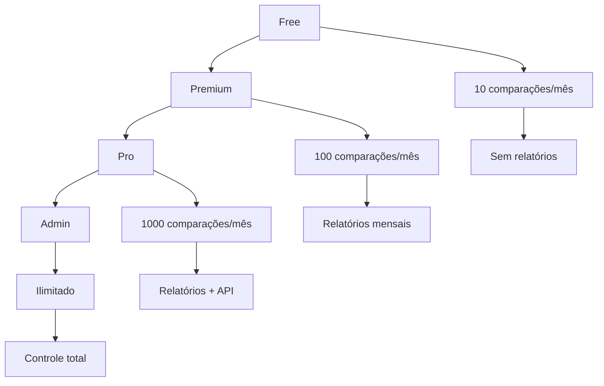
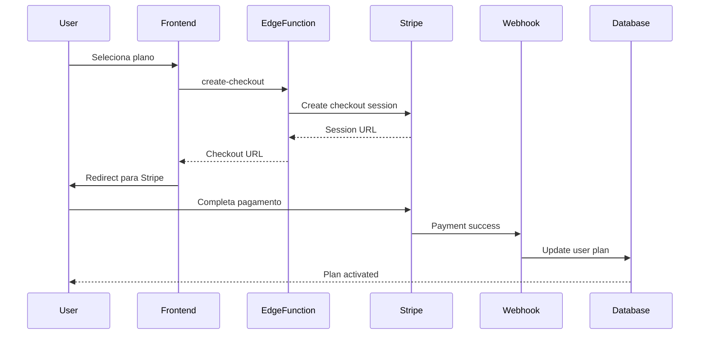

# 07 - Planos de Assinatura

## 💰 Estrutura de Planos

O sistema implementa 4 tiers de planos para atender diferentes perfis de usuários, desde consumidores casuais até administradores do sistema.

### Visão Geral dos Planos



## 📊 Comparativo de Planos

| Funcionalidade | Free | Premium | Pro | Admin |
|----------------|------|---------|-----|-------|
| **Preço** | R$ 0 | R$ 9,90/mês | R$ 29,90/mês | Convite |
| **Comparações/mês** | 10 | 100 | 1.000 | Ilimitado |
| **Visualizar ofertas** | ✅ | ✅ | ✅ | ✅ |
| **Contribuir ofertas** | ✅ | ✅ | ✅ | ✅ |
| **Histórico de comparações** | 30 dias | 1 ano | Ilimitado | Ilimitado |
| **Exportar PDF** | ❌ | ✅ | ✅ | ✅ |
| **Relatórios mensais** | ❌ | ✅ | ✅ | ✅ |
| **Gráficos avançados** | ❌ | ✅ | ✅ | ✅ |
| **API Access** | ❌ | ❌ | ✅ | ✅ |
| **Suporte prioritário** | ❌ | ✅ | ✅ | ✅ |
| **Modo offline avançado** | ❌ | ❌ | ✅ | ✅ |
| **Painel administrativo** | ❌ | ❌ | ❌ | ✅ |
| **Moderação de conteúdo** | ❌ | ❌ | ❌ | ✅ |
| **Analytics do sistema** | ❌ | ❌ | ❌ | ✅ |

## 🆓 Plano Free

### Limitações
- **10 comparações por mês**
- **Histórico limitado**: Apenas 30 dias
- **Sem exportação**: Não pode gerar PDFs
- **Sem relatórios**: Não acessa análises mensais

### Público-Alvo
- Usuários casuais
- Pessoas testando a plataforma
- Uso esporádico para compras específicas

### Implementação Técnica

```typescript
// Configuração do plano Free
export const FREE_PLAN_LIMITS = {
  comparisons_per_month: 10,
  history_retention_days: 30,
  export_formats: [],
  features: [
    'view_offers',
    'contribute_offers',
    'basic_comparisons'
  ]
} as const;
```

```sql
-- Verificação de limite para plano Free
CREATE OR REPLACE FUNCTION check_free_plan_limit(user_id UUID)
RETURNS boolean AS $$
DECLARE
  current_count INTEGER;
  user_plan TEXT;
BEGIN
  SELECT plan, comparisons_made_this_month 
  INTO user_plan, current_count
  FROM profiles 
  WHERE id = user_id;
  
  IF user_plan = 'free' AND current_count >= 10 THEN
    RETURN false;
  END IF;
  
  RETURN true;
END;
$$ LANGUAGE plpgsql;
```

## 💎 Plano Premium

### Benefícios
- **100 comparações por mês**
- **Relatórios mensais** com gráficos
- **Exportação PDF** das comparações
- **Histórico de 1 ano**
- **Suporte prioritário**

### Preço
- **R$ 9,90/mês** ou **R$ 99,00/ano** (2 meses grátis)

### Público-Alvo
- Famílias que fazem compras regulares
- Pessoas que querem economizar de forma consistente
- Usuários que valorizam relatórios e análises

### Features Exclusivas

```typescript
export const PREMIUM_FEATURES = {
  monthly_reports: true,
  pdf_export: true,
  advanced_charts: true,
  priority_support: true,
  comparison_history: '1 year',
  comparisons_per_month: 100
} as const;
```

## 🚀 Plano Pro

### Benefícios
- **1.000 comparações por mês**
- **API Access** para integrações
- **Modo offline avançado**
- **Relatórios personalizáveis**
- **Histórico ilimitado**
- **Suporte dedicado**

### Preço
- **R$ 29,90/mês** ou **R$ 299,00/ano** (2 meses grátis)

### Público-Alvo
- Empresas pequenas/médias
- Desenvolvedores que querem integrar
- Power users com necessidades avançadas
- Consultores em varejo

### API Access

```typescript
// Exemplo de uso da API Pro
interface ProAPIAccess {
  endpoints: {
    products: '/api/v1/products';
    comparisons: '/api/v1/comparisons';
    offers: '/api/v1/offers';
    analytics: '/api/v1/analytics';
  };
  rate_limits: {
    requests_per_hour: 1000;
    requests_per_day: 10000;
  };
  features: {
    webhooks: boolean;
    bulk_operations: boolean;
    custom_integrations: boolean;
  };
}
```

## 👑 Plano Admin

### Acesso Exclusivo
- Apenas por **convite ou email autorizado**
- Controle total do sistema
- Sem limitações de uso

### Funcionalidades Administrativas
- **Painel completo** de analytics
- **Moderação** de contribuições
- **Gestão de usuários**
- **Configurações do sistema**
- **Relatórios de uso**

### Implementação de Segurança

```sql
-- Verificação automática de admin por email
CREATE OR REPLACE FUNCTION auto_assign_admin_plan()
RETURNS trigger AS $$
BEGIN
  IF NEW.email IN ('mariorenan25@gmail.com', 'mariovendasonline10k@gmail.com') THEN
    NEW.plan := 'admin';
  END IF;
  
  RETURN NEW;
END;
$$ LANGUAGE plpgsql;

CREATE TRIGGER auto_admin_trigger
  BEFORE INSERT OR UPDATE ON profiles
  FOR EACH ROW
  EXECUTE FUNCTION auto_assign_admin_plan();
```

## 💳 Sistema de Pagamentos

### Integração Stripe

```typescript
// Configuração dos produtos Stripe
export const STRIPE_PRODUCTS = {
  premium_monthly: {
    priceId: 'price_premium_monthly_990',
    amount: 990, // R$ 9,90 em centavos
    currency: 'brl',
    interval: 'month'
  },
  premium_yearly: {
    priceId: 'price_premium_yearly_9900',
    amount: 9900, // R$ 99,00 em centavos
    currency: 'brl',
    interval: 'year'
  },
  pro_monthly: {
    priceId: 'price_pro_monthly_2990',
    amount: 2990, // R$ 29,90 em centavos
    currency: 'brl',
    interval: 'month'
  },
  pro_yearly: {
    priceId: 'price_pro_yearly_29900',
    amount: 29900, // R$ 299,00 em centavos
    currency: 'brl',
    interval: 'year'
  }
} as const;
```

### Fluxo de Checkout



### Edge Function de Checkout

```typescript
// supabase/functions/create-checkout/index.ts
export default async function handler(req: Request) {
  const { priceId, customerId } = await req.json();
  
  const session = await stripe.checkout.sessions.create({
    customer: customerId,
    payment_method_types: ['card', 'boleto'],
    line_items: [{
      price: priceId,
      quantity: 1,
    }],
    mode: 'subscription',
    success_url: `${req.headers.get('origin')}/success?session_id={CHECKOUT_SESSION_ID}`,
    cancel_url: `${req.headers.get('origin')}/plans`,
    locale: 'pt-BR',
  });

  return new Response(JSON.stringify({ url: session.url }), {
    headers: { 'Content-Type': 'application/json' },
  });
}
```

## 📈 Estratégia de Preços

### Pesquisa de Mercado

| Concorrente | Plano Básico | Plano Premium | Diferencial |
|-------------|--------------|---------------|-------------|
| **Pelando** | Grátis + Ads | R$ 4,90/mês | Foco em ofertas |
| **Zoom** | Grátis limitado | R$ 15,90/mês | Comparação automática |
| **Buscapé** | Grátis | - | Marketplace integrado |
| **Nosso App** | Grátis (10/mês) | R$ 9,90/mês | Comunidade + Relatórios |

### Posicionamento
- **Premium competitivo**: R$ 9,90 vs R$ 15,90 do principal concorrente
- **Valor único**: Relatórios personalizados + comunidade ativa
- **Freemium strategy**: Permite teste real antes da conversão

### Métricas de Conversão

```typescript
// Tracking de conversão por plano
export const CONVERSION_METRICS = {
  free_to_premium: {
    current_rate: 0.12, // 12%
    target_rate: 0.18,   // 18%
    triggers: [
      'comparison_limit_reached',
      'pdf_export_attempt',
      'report_view_attempt'
    ]
  },
  premium_to_pro: {
    current_rate: 0.05, // 5%
    target_rate: 0.08,  // 8%
    triggers: [
      'api_access_request',
      'bulk_operations_need',
      'advanced_analytics_usage'
    ]
  }
} as const;
```

## 🎯 Estratégias de Upgrade

### Upgrade Prompts

```typescript
// Componente de prompt para upgrade
export const UpgradePrompt: React.FC<{
  trigger: 'limit_reached' | 'feature_blocked' | 'report_access';
  currentPlan: PlanTier;
}> = ({ trigger, currentPlan }) => {
  const upgradeReasons = {
    limit_reached: {
      title: "Você atingiu o limite mensal!",
      description: "Faça quantas comparações quiser com o plano Premium",
      ctaText: "Upgrade para Premium"
    },
    feature_blocked: {
      title: "Recurso Premium",
      description: "Exportação em PDF disponível apenas para assinantes",
      ctaText: "Desbloquear Recurso"
    },
    report_access: {
      title: "Relatórios Mensais",
      description: "Veja suas economias e padrões de compra detalhados",
      ctaText: "Ver Relatórios"
    }
  };

  // ... implementação do componente
};
```

### Trial Period

```sql
-- Sistema de trial para novos usuários
CREATE TABLE user_trials (
  id UUID DEFAULT gen_random_uuid() PRIMARY KEY,
  user_id UUID REFERENCES auth.users(id) ON DELETE CASCADE,
  plan TEXT NOT NULL,
  started_at TIMESTAMP WITH TIME ZONE DEFAULT NOW(),
  ends_at TIMESTAMP WITH TIME ZONE NOT NULL,
  converted BOOLEAN DEFAULT false,
  created_at TIMESTAMP WITH TIME ZONE DEFAULT NOW()
);

-- Função para verificar trial ativo
CREATE OR REPLACE FUNCTION has_active_trial(user_uuid UUID)
RETURNS boolean AS $$
BEGIN
  RETURN EXISTS(
    SELECT 1 FROM user_trials 
    WHERE user_id = user_uuid 
      AND ends_at > NOW() 
      AND NOT converted
  );
END;
$$ LANGUAGE plpgsql;
```

## 📊 Analytics de Planos

### Métricas Principais

```typescript
export interface PlanAnalytics {
  subscription_metrics: {
    mrr: number; // Monthly Recurring Revenue
    arr: number; // Annual Recurring Revenue
    churn_rate: number;
    ltv: number; // Lifetime Value
    cac: number; // Customer Acquisition Cost
  };
  
  conversion_funnel: {
    visitors: number;
    free_signups: number;
    trial_starts: number;
    paid_conversions: number;
    upgrade_rate: number;
  };
  
  usage_patterns: {
    avg_comparisons_per_user: number;
    feature_adoption_rates: Record<string, number>;
    retention_by_plan: Record<PlanTier, number>;
  };
}
```

### Dashboard de Revenue

```sql
-- Query para métricas de receita
WITH plan_revenue AS (
  SELECT 
    plan,
    COUNT(*) as active_users,
    CASE plan
      WHEN 'premium' THEN COUNT(*) * 9.90
      WHEN 'pro' THEN COUNT(*) * 29.90
      ELSE 0
    END as monthly_revenue
  FROM profiles 
  WHERE plan IN ('premium', 'pro')
  GROUP BY plan
)
SELECT 
  plan,
  active_users,
  monthly_revenue,
  monthly_revenue * 12 as annual_revenue
FROM plan_revenue;
```

## 🔄 Gestão de Ciclo de Vida

### Onboarding por Plano

```typescript
// Fluxo de onboarding personalizado
export const PlanOnboarding = {
  free: [
    'welcome_tutorial',
    'first_comparison_guide',
    'contribution_introduction'
  ],
  premium: [
    'premium_welcome',
    'pdf_export_demo',
    'reports_tour',
    'advanced_features_intro'
  ],
  pro: [
    'pro_welcome',
    'api_documentation',
    'advanced_analytics_tour',
    'integration_examples'
  ]
} as const;
```

### Prevenção de Churn

```typescript
// Sistema de alerta para usuários em risco
export const ChurnPrevention = {
  identify_at_risk_users: async () => {
    // Usuários que não usaram nos últimos 7 dias
    const inactive_users = await supabase
      .from('profiles')
      .select('id, email, plan, last_login')
      .lt('last_login', new Date(Date.now() - 7 * 24 * 60 * 60 * 1000))
      .in('plan', ['premium', 'pro']);
    
    return inactive_users.data || [];
  },
  
  engagement_campaigns: {
    '3_days_inactive': 'Sentimos sua falta! Veja as novas ofertas',
    '7_days_inactive': 'Ofertas especiais esperando por você',
    '14_days_inactive': 'Que tal economizar hoje? 💰',
    'before_renewal': 'Veja quanto você economizou este mês!'
  }
} as const;
```

## 💡 Roadmap de Planos

### Q1 2024
- [x] Implementação básica dos 4 planos
- [x] Integração com Stripe
- [x] Sistema de limites
- [ ] Programa de trial gratuito

### Q2 2024
- [ ] **Plano Business** (R$ 99/mês)
  - Múltiplos usuários
  - Dashboard empresarial
  - API avançada
- [ ] **Add-ons** opcionais
  - Usuários extras
  - Storage adicional
  - Suporte 24/7

### Q3 2024
- [ ] **Plano Enterprise** (Sob consulta)
  - White-label
  - On-premise option
  - SLA garantido
- [ ] **Marketplace de integrações**
  - Conectores com ERPs
  - Plugins de terceiros

### Q4 2024
- [ ] **Programa de afiliados**
- [ ] **Descontos corporativos**
- [ ] **Planos regionais**