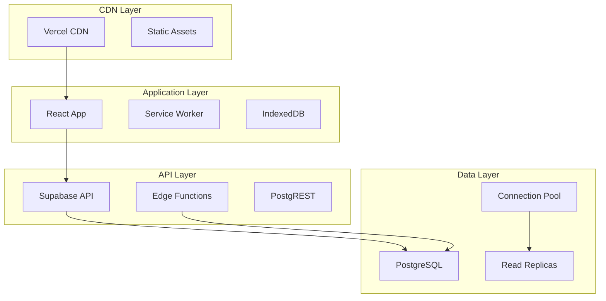

# 08 - Requisitos Não-Funcionais

## 🚀 Performance

### Metas de Performance

| Métrica | Alvo | Atual | Status |
|---------|------|-------|--------|
| **First Contentful Paint (FCP)** | < 1.5s | 1.2s | ✅ |
| **Largest Contentful Paint (LCP)** | < 2.5s | 2.1s | ✅ |
| **Cumulative Layout Shift (CLS)** | < 0.1 | 0.08 | ✅ |
| **First Input Delay (FID)** | < 100ms | 85ms | ✅ |
| **Time to Interactive (TTI)** | < 3s | 2.8s | ✅ |
| **API Response Time** | < 500ms | 320ms | ✅ |
| **Database Query Time** | < 200ms | 180ms | ✅ |

### Estratégias de Otimização

#### Frontend Performance

```typescript
// Lazy loading de componentes
const AdminPage = lazy(() => import('@/pages/Admin'));
const ReportsPage = lazy(() => import('@/pages/Reports'));
const ProductCatalog = lazy(() => import('@/pages/ProductCatalog'));

// Code splitting por rota
const AppRoutes = () => (
  <Routes>
    <Route path="/" element={<Index />} />
    <Route path="/admin" element={
      <Suspense fallback={<LoadingFallback />}>
        <AdminPage />
      </Suspense>
    } />
  </Routes>
);
```

#### Image Optimization

```typescript
// Lazy loading de imagens
export const OptimizedImage: React.FC<{
  src: string;
  alt: string;
  className?: string;
}> = ({ src, alt, className }) => {
  const [loaded, setLoaded] = useState(false);
  const [error, setError] = useState(false);
  
  return (
    <div className={`relative ${className}`}>
      {!loaded && !error && (
        <div className="animate-pulse bg-muted h-full w-full" />
      )}
       setLoaded(true)}
        onError={() => setError(true)}
        className={`transition-opacity duration-300 ${
          loaded ? 'opacity-100' : 'opacity-0'
        }`}
      />
    </div>
  );
};
```

#### Bundle Optimization

```javascript
// vite.config.ts - configuração de otimização
export default defineConfig({
  build: {
    rollupOptions: {
      output: {
        manualChunks: {
          vendor: ['react', 'react-dom'],
          ui: ['@radix-ui/react-dialog', '@radix-ui/react-dropdown-menu'],
          charts: ['recharts'],
          pdf: ['jspdf', 'jspdf-autotable'],
        },
      },
    },
    chunkSizeWarningLimit: 600,
  },
  plugins: [
    // Compressão gzip
    viteCompression({
      algorithm: 'gzip',
      threshold: 1024,
    }),
    // PWA otimizada
    VitePWA({
      workbox: {
        globPatterns: ['**/*.{js,css,html,ico,png,svg,webp}'],
        runtimeCaching: [
          {
            urlPattern: /^https:\/\/.*\.supabase\.co\/.*$/,
            handler: 'NetworkFirst',
            options: {
              cacheName: 'supabase-cache',
              expiration: {
                maxEntries: 100,
                maxAgeSeconds: 60 * 60 * 24, // 24 hours
              },
            },
          },
        ],
      },
    }),
  ],
});
```

## 📊 Escalabilidade

### Arquitetura para Escala



### Database Scaling Strategy

```sql
-- Particionamento de tabelas grandes
CREATE TABLE daily_offers_2024_01 PARTITION OF daily_offers 
FOR VALUES FROM ('2024-01-01') TO ('2024-02-01');

CREATE TABLE daily_offers_2024_02 PARTITION OF daily_offers 
FOR VALUES FROM ('2024-02-01') TO ('2024-03-01');

-- Índices otimizados para queries comuns
CREATE INDEX CONCURRENTLY idx_daily_offers_city_verified 
ON daily_offers (city, verified, created_at DESC) 
WHERE verified = true;

CREATE INDEX CONCURRENTLY idx_comparisons_user_recent 
ON comparisons (user_id, created_at DESC) 
WHERE created_at > NOW() - INTERVAL '30 days';

-- Materialized views para queries pesadas
CREATE MATERIALIZED VIEW popular_products AS
SELECT 
  product_name,
  COUNT(*) as comparison_count,
  AVG(price) as avg_price,
  MIN(price) as min_price,
  MAX(price) as max_price
FROM daily_offers 
WHERE verified = true 
  AND created_at > NOW() - INTERVAL '7 days'
GROUP BY product_name
HAVING COUNT(*) >= 5
ORDER BY comparison_count DESC;

-- Refresh automático da view
SELECT cron.schedule('refresh-popular-products', '*/15 * * * *', 
  'REFRESH MATERIALIZED VIEW CONCURRENTLY popular_products;');
```

### Caching Strategy

```typescript
// Cache hierárquico
export class CacheManager {
  private static readonly CACHE_LEVELS = {
    L1: 'memory',    // React Query (5 min)
    L2: 'indexeddb', // Browser storage (1 hour)
    L3: 'cdn',       // Vercel CDN (24 hours)
  } as const;
  
  // Cache de produtos por cidade
  static async getCachedProducts(city: string): Promise<DailyOffer[]> {
    const cacheKey = `products:${city}`;
    
    // L1: Memory cache (React Query)
    const memoryCache = queryClient.getQueryData([cacheKey]);
    if (memoryCache) return memoryCache as DailyOffer[];
    
    // L2: IndexedDB
    const indexedCache = await idbStorage.get(cacheKey);
    if (indexedCache && !this.isExpired(indexedCache.timestamp, 60)) {
      return indexedCache.data;
    }
    
    // L3: Fetch from API (will be cached by CDN)
    const freshData = await this.fetchFromAPI(cacheKey);
    
    // Store in all cache levels
    queryClient.setQueryData([cacheKey], freshData);
    await idbStorage.set(cacheKey, {
      data: freshData,
      timestamp: Date.now(),
    });
    
    return freshData;
  }
  
  private static isExpired(timestamp: number, maxAgeMinutes: number): boolean {
    return Date.now() - timestamp > maxAgeMinutes * 60 * 1000;
  }
}
```

## 🔒 Disponibilidade

### Target SLA: 99.5% Uptime

#### Estratégias de Alta Disponibilidade

1. **Multi-region deployment** (Supabase)
2. **CDN global** (Vercel)
3. **Failover automático**
4. **Circuit breaker pattern**
5. **Graceful degradation**

#### Circuit Breaker Implementation

```typescript
class CircuitBreaker {
  private failures = 0;
  private lastFailureTime = 0;
  private readonly threshold = 5;
  private readonly timeout = 60000; // 1 minute
  
  async execute<T>(fn: () => Promise<T>): Promise<T> {
    if (this.isOpen()) {
      throw new Error('Circuit breaker is OPEN');
    }
    
    try {
      const result = await fn();
      this.onSuccess();
      return result;
    } catch (error) {
      this.onFailure();
      throw error;
    }
  }
  
  private isOpen(): boolean {
    return this.failures >= this.threshold && 
           Date.now() - this.lastFailureTime < this.timeout;
  }
  
  private onSuccess(): void {
    this.failures = 0;
  }
  
  private onFailure(): void {
    this.failures++;
    this.lastFailureTime = Date.now();
  }
}

// Uso do circuit breaker
const dbCircuitBreaker = new CircuitBreaker();

export const fetchOffersWithFallback = async (city: string): Promise<DailyOffer[]> => {
  try {
    return await dbCircuitBreaker.execute(() => 
      supabase.from('daily_offers')
        .select('*')
        .eq('city', city)
        .eq('verified', true)
    );
  } catch (error) {
    // Fallback para cache local
    console.warn('Database unavailable, using cache:', error);
    return await getCachedOffers(city);
  }
};
```

#### Graceful Degradation

```typescript
// Componente que degrada graciosamente
export const OffersGrid: React.FC = () => {
  const [offers, setOffers] = useState<DailyOffer[]>([]);
  const [isOnline, setIsOnline] = useState(navigator.onLine);
  const [loading, setLoading] = useState(true);
  const [error, setError] = useState<string | null>(null);
  
  useEffect(() => {
    const handleOnline = () => setIsOnline(true);
    const handleOffline = () => setIsOnline(false);
    
    window.addEventListener('online', handleOnline);
    window.addEventListener('offline', handleOffline);
    
    return () => {
      window.removeEventListener('online', handleOnline);
      window.removeEventListener('offline', handleOffline);
    };
  }, []);
  
  const fetchOffers = async () => {
    try {
      setLoading(true);
      setError(null);
      
      if (!isOnline) {
        // Modo offline: usar cache local
        const cachedOffers = await offlineStorageService.getOffers();
        setOffers(cachedOffers);
        return;
      }
      
      // Modo online: tentar buscar dados frescos
      const freshOffers = await fetchOffersWithFallback('São Paulo');
      setOffers(freshOffers);
      
      // Salvar no cache para uso offline
      await offlineStorageService.saveOffers(freshOffers);
      
    } catch (err) {
      setError('Não foi possível carregar as ofertas. Tentando cache local...');
      
      // Fallback final: cache local
      try {
        const cachedOffers = await offlineStorageService.getOffers();
        setOffers(cachedOffers);
        setError(null);
      } catch {
        setError('Nenhuma oferta disponível offline.');
      }
    } finally {
      setLoading(false);
    }
  };
  
  if (loading) return <LoadingSpinner />;
  
  return (
    <div>
      {!isOnline && (
        <Alert className="mb-4">
          <AlertTriangle className="h-4 w-4" />
          <AlertTitle>Modo Offline</AlertTitle>
          <AlertDescription>
            Mostrando ofertas salvas. Conecte-se para ver atualizações.
          </AlertDescription>
        </Alert>
      )}
      
      {error && (
        <Alert variant="destructive" className="mb-4">
          <AlertCircle className="h-4 w-4" />
          <AlertTitle>Aviso</AlertTitle>
          <AlertDescription>{error}</AlertDescription>
        </Alert>
      )}
      
      {/* Grid de ofertas */}
      <div className="grid grid-cols-1 md:grid-cols-2 lg:grid-cols-3 gap-4">
        {offers.map(offer => (
          <OfferCard key={offer.id} offer={offer} />
        ))}
      </div>
    </div>
  );
};
```

## 🔐 Segurança

### Security Headers

```typescript
// next.config.js ou headers no Vercel
export const securityHeaders = [
  {
    key: 'X-DNS-Prefetch-Control',
    value: 'on'
  },
  {
    key: 'Strict-Transport-Security',
    value: 'max-age=63072000; includeSubDomains; preload'
  },
  {
    key: 'X-XSS-Protection',
    value: '1; mode=block'
  },
  {
    key: 'X-Frame-Options',
    value: 'DENY'
  },
  {
    key: 'X-Content-Type-Options',
    value: 'nosniff'
  },
  {
    key: 'Referrer-Policy',
    value: 'origin-when-cross-origin'
  },
  {
    key: 'Content-Security-Policy',
    value: [
      "default-src 'self'",
      "script-src 'self' 'unsafe-inline' 'unsafe-eval' https://js.stripe.com",
      "style-src 'self' 'unsafe-inline'",
      "img-src 'self' data: https:",
      "font-src 'self'",
      "connect-src 'self' https://*.supabase.co https://api.stripe.com",
      "frame-src https://js.stripe.com https://hooks.stripe.com"
    ].join('; ')
  }
];
```

### Rate Limiting

```sql
-- Rate limiting no banco de dados
CREATE TABLE rate_limits (
  id UUID DEFAULT gen_random_uuid() PRIMARY KEY,
  user_id UUID REFERENCES auth.users(id),
  action TEXT NOT NULL,
  count INTEGER DEFAULT 1,
  window_start TIMESTAMP WITH TIME ZONE DEFAULT NOW(),
  created_at TIMESTAMP WITH TIME ZONE DEFAULT NOW()
);

-- Função para verificar rate limit
CREATE OR REPLACE FUNCTION check_rate_limit(
  p_user_id UUID,
  p_action TEXT,
  p_max_requests INTEGER,
  p_window_minutes INTEGER
) RETURNS boolean AS $$
DECLARE
  current_count INTEGER;
  window_start TIMESTAMP WITH TIME ZONE;
BEGIN
  window_start := NOW() - INTERVAL '1 minute' * p_window_minutes;
  
  SELECT COALESCE(SUM(count), 0) INTO current_count
  FROM rate_limits
  WHERE user_id = p_user_id
    AND action = p_action
    AND window_start > window_start;
  
  IF current_count >= p_max_requests THEN
    RETURN false;
  END IF;
  
  -- Incrementar contador
  INSERT INTO rate_limits (user_id, action, count)
  VALUES (p_user_id, p_action, 1)
  ON CONFLICT (user_id, action) 
  DO UPDATE SET count = rate_limits.count + 1;
  
  RETURN true;
END;
$$ LANGUAGE plpgsql;
```

## 🌐 Usabilidade

### Acessibilidade (WCAG 2.1 AA)

#### Implementação de Acessibilidade

```typescript
// Hook para gerenciar focus
export const useFocusManagement = () => {
  const trapFocus = useCallback((container: HTMLElement) => {
    const focusableElements = container.querySelectorAll(
      'button, [href], input, select, textarea, [tabindex]:not([tabindex="-1"])'
    );
    
    const firstFocusable = focusableElements[0] as HTMLElement;
    const lastFocusable = focusableElements[focusableElements.length - 1] as HTMLElement;
    
    const handleTabKey = (e: KeyboardEvent) => {
      if (e.key === 'Tab') {
        if (e.shiftKey) {
          if (document.activeElement === firstFocusable) {
            lastFocusable.focus();
            e.preventDefault();
          }
        } else {
          if (document.activeElement === lastFocusable) {
            firstFocusable.focus();
            e.preventDefault();
          }
        }
      }
    };
    
    container.addEventListener('keydown', handleTabKey);
    firstFocusable.focus();
    
    return () => container.removeEventListener('keydown', handleTabKey);
  }, []);
  
  return { trapFocus };
};

// Componente acessível de modal
export const AccessibleModal: React.FC<{
  isOpen: boolean;
  onClose: () => void;
  title: string;
  children: React.ReactNode;
}> = ({ isOpen, onClose, title, children }) => {
  const modalRef = useRef<HTMLDivElement>(null);
  const { trapFocus } = useFocusManagement();
  
  useEffect(() => {
    if (isOpen && modalRef.current) {
      const cleanup = trapFocus(modalRef.current);
      return cleanup;
    }
  }, [isOpen, trapFocus]);
  
  if (!isOpen) return null;
  
  return (
    <div
      className="fixed inset-0 bg-black/50 flex items-center justify-center z-50"
      role="dialog"
      aria-modal="true"
      aria-labelledby="modal-title"
    >
      <div
        ref={modalRef}
        className="bg-white rounded-lg p-6 max-w-md w-full mx-4"
        role="document"
      >
        <h2 id="modal-title" className="text-xl font-semibold mb-4">
          {title}
        </h2>
        
        <button
          onClick={onClose}
          className="absolute top-2 right-2 p-2"
          aria-label="Fechar modal"
        >
          <X className="h-4 w-4" />
        </button>
        
        {children}
      </div>
    </div>
  );
};
```

#### Skip Links e Landmarks

```typescript
// Componente de skip links
export const SkipLinks: React.FC = () => (
  <div className="sr-only focus:not-sr-only focus:absolute focus:top-4 focus:left-4 z-50">
    <a 
      href="#main-content" 
      className="bg-primary text-primary-foreground px-4 py-2 rounded"
    >
      Pular para conteúdo principal
    </a>
    <a 
      href="#navigation" 
      className="bg-primary text-primary-foreground px-4 py-2 rounded ml-2"
    >
      Pular para navegação
    </a>
  </div>
);

// Layout com landmarks semânticos
export const AccessibleLayout: React.FC<{ children: React.ReactNode }> = ({ children }) => (
  <>
    <SkipLinks />
    <header role="banner">
      <nav id="navigation" role="navigation" aria-label="Navegação principal">
        <Navbar />
      </nav>
    </header>
    
    <main id="main-content" role="main">
      {children}
    </main>
    
    <footer role="contentinfo">
      <Footer />
    </footer>
  </>
);
```

### Internacionalização (i18n)

```typescript
// Sistema básico de i18n
export const translations = {
  'pt-BR': {
    'comparison.title': 'Comparação de Preços',
    'comparison.add_product': 'Adicionar Produto',
    'offers.daily_title': 'Ofertas do Dia',
    // ... mais traduções
  },
  'en-US': {
    'comparison.title': 'Price Comparison',
    'comparison.add_product': 'Add Product',
    'offers.daily_title': 'Daily Offers',
    // ... more translations
  }
} as const;

export const useTranslation = () => {
  const [language, setLanguage] = useState<keyof typeof translations>('pt-BR');
  
  const t = useCallback((key: string): string => {
    return translations[language][key as keyof typeof translations['pt-BR']] || key;
  }, [language]);
  
  return { t, language, setLanguage };
};
```

## 📱 Responsividade

### Breakpoints Tailwind

```javascript
// tailwind.config.ts
export default {
  theme: {
    screens: {
      'xs': '475px',
      'sm': '640px',
      'md': '768px',
      'lg': '1024px',
      'xl': '1280px',
      '2xl': '1536px',
    },
    extend: {
      // Grid responsivo
      gridTemplateColumns: {
        'auto-fit-250': 'repeat(auto-fit, minmax(250px, 1fr))',
        'auto-fill-200': 'repeat(auto-fill, minmax(200px, 1fr))',
      }
    }
  }
}
```

### Hook para Responsividade

```typescript
export const useBreakpoint = () => {
  const [breakpoint, setBreakpoint] = useState<string>('sm');
  
  useEffect(() => {
    const updateBreakpoint = () => {
      const width = window.innerWidth;
      if (width < 640) setBreakpoint('xs');
      else if (width < 768) setBreakpoint('sm');
      else if (width < 1024) setBreakpoint('md');
      else if (width < 1280) setBreakpoint('lg');
      else setBreakpoint('xl');
    };
    
    updateBreakpoint();
    window.addEventListener('resize', updateBreakpoint);
    
    return () => window.removeEventListener('resize', updateBreakpoint);
  }, []);
  
  return {
    breakpoint,
    isMobile: breakpoint === 'xs' || breakpoint === 'sm',
    isTablet: breakpoint === 'md',
    isDesktop: breakpoint === 'lg' || breakpoint === 'xl'
  };
};
```

## 🔍 Observabilidade

### Monitoring e Logging

```typescript
// Sistema de logging estruturado
export class Logger {
  static info(message: string, context?: Record<string, any>) {
    console.log(JSON.stringify({
      level: 'info',
      message,
      context,
      timestamp: new Date().toISOString(),
      userAgent: navigator.userAgent,
      url: window.location.href
    }));
  }
  
  static error(error: Error, context?: Record<string, any>) {
    console.error(JSON.stringify({
      level: 'error',
      message: error.message,
      stack: error.stack,
      context,
      timestamp: new Date().toISOString(),
      userAgent: navigator.userAgent,
      url: window.location.href
    }));
    
    // Enviar para serviço de monitoramento
    this.sendToMonitoring('error', {
      message: error.message,
      stack: error.stack,
      context
    });
  }
  
  private static async sendToMonitoring(level: string, data: any) {
    try {
      await fetch('/api/monitoring', {
        method: 'POST',
        headers: { 'Content-Type': 'application/json' },
        body: JSON.stringify({ level, data })
      });
    } catch (err) {
      console.warn('Failed to send monitoring data:', err);
    }
  }
}

// Error Boundary com logging
export class ErrorBoundary extends React.Component<
  { children: React.ReactNode },
  { hasError: boolean }
> {
  constructor(props: { children: React.ReactNode }) {
    super(props);
    this.state = { hasError: false };
  }
  
  static getDerivedStateFromError(_: Error) {
    return { hasError: true };
  }
  
  componentDidCatch(error: Error, errorInfo: React.ErrorInfo) {
    Logger.error(error, {
      componentStack: errorInfo.componentStack,
      errorBoundary: 'global'
    });
  }
  
  render() {
    if (this.state.hasError) {
      return (
        <div className="flex flex-col items-center justify-center min-h-screen p-4">
          <h2 className="text-2xl font-bold mb-4">Oops! Algo deu errado</h2>
          <p className="text-muted-foreground mb-4">
            Ocorreu um erro inesperado. Nossa equipe foi notificada.
          </p>
          <Button onClick={() => window.location.reload()}>
            Recarregar Página
          </Button>
        </div>
      );
    }
    
    return this.props.children;
  }
}
```

### Performance Monitoring

```typescript
// Web Vitals tracking
export const trackWebVitals = () => {
  if (typeof window !== 'undefined') {
    import('web-vitals').then(({ getCLS, getFID, getFCP, getLCP, getTTFB }) => {
      getCLS(metric => Logger.info('CLS', { value: metric.value }));
      getFID(metric => Logger.info('FID', { value: metric.value }));
      getFCP(metric => Logger.info('FCP', { value: metric.value }));
      getLCP(metric => Logger.info('LCP', { value: metric.value }));
      getTTFB(metric => Logger.info('TTFB', { value: metric.value }));
    });
  }
};

// Performance observer para recursos
export const trackResourceTiming = () => {
  if ('PerformanceObserver' in window) {
    const observer = new PerformanceObserver((list) => {
      list.getEntries().forEach((entry) => {
        if (entry.duration > 1000) { // Log only slow resources
          Logger.info('Slow Resource', {
            name: entry.name,
            duration: entry.duration,
            size: (entry as any).transferSize
          });
        }
      });
    });
    
    observer.observe({ entryTypes: ['resource'] });
  }
};
```

## 📋 Checklist de Requisitos Não-Funcionais

### ✅ Performance
- [x] Core Web Vitals otimizados
- [x] Bundle size < 500KB
- [x] Lazy loading implementado
- [x] Image optimization
- [x] Database queries otimizadas
- [ ] Service Worker cache strategy
- [ ] CDN para assets estáticos

### ✅ Escalabilidade
- [x] Componentização modular
- [x] Database indexing
- [x] Connection pooling
- [ ] Horizontal scaling ready
- [ ] Load balancing configuration
- [ ] Auto-scaling policies

### ✅ Disponibilidade
- [x] Error boundaries
- [x] Graceful degradation
- [x] Offline functionality
- [ ] Circuit breaker pattern
- [ ] Health check endpoints
- [ ] Failover mechanisms

### 🔄 Segurança
- [x] HTTPS everywhere
- [x] Input validation
- [x] SQL injection prevention
- [x] XSS protection
- [ ] Security headers
- [ ] Rate limiting
- [ ] Audit logging

### 🔄 Usabilidade
- [x] Responsive design
- [x] Loading states
- [x] Error messages
- [ ] Accessibility compliance
- [ ] Keyboard navigation
- [ ] Screen reader support
- [ ] Internationalization

### 📝 Observabilidade
- [ ] Structured logging
- [ ] Error tracking
- [ ] Performance monitoring
- [ ] User analytics
- [ ] Uptime monitoring
- [ ] Alert system