# 09 - Métricas e Analytics

## 📊 Visão Geral do Sistema de Métricas

O sistema de analytics é estruturado em 4 camadas principais para fornecer insights abrangentes sobre performance, uso e satisfação dos usuários.

```mermaid
graph TD
    A[Eventos de Frontend] --> B[Coleta de Dados]
    C[Logs de Backend] --> B
    D[Métricas de Negócio] --> B
    
    B --> E[Processamento]
    E --> F[Dashboards]
    E --> G[Alertas]
    E --> H[Relatórios]
    
    subgraph "Stakeholders"
        I[Produto]
        J[Desenvolvimento]
        K[Negócio]
        L[Suporte]
    end
    
    F --> I
    F --> J
    G --> L
    H --> K
```



## 📈 KPIs Principais

### Métricas de Produto

| KPI | Definição | Meta | Atual | Tendência |
|-----|-----------|------|-------|-----------|
| **MAU** | Usuários ativos mensais | 50.000 | 12.500 | ↗️ +25% |
| **DAU** | Usuários ativos diários | 8.000 | 2.100 | ↗️ +18% |
| **Stickiness** | DAU/MAU ratio | 20% | 16.8% | ↗️ +2% |
| **Session Duration** | Tempo médio de sessão | 8 min | 6.2 min | ↗️ +12% |
| **Bounce Rate** | Taxa de rejeição | <40% | 35% | ↘️ -8% |

### Métricas de Negócio

| KPI | Definição | Meta | Atual | Tendência |
|-----|-----------|------|-------|-----------|
| **MRR** | Receita recorrente mensal | R$ 50.000 | R$ 8.200 | ↗️ +35% |
| **ARPU** | Receita média por usuário | R$ 12 | R$ 8.50 | ↗️ +15% |
| **LTV** | Lifetime Value | R$ 180 | R$ 125 | ↗️ +22% |
| **CAC** | Custo de aquisição | R$ 25 | R$ 32 | ↘️ -12% |
| **Churn Rate** | Taxa de cancelamento | <5% | 6.2% | ↘️ -1.5% |

### Métricas de Funcionalidade

| Feature | Uso (%) | Satisfação | Retenção 7d |
|---------|---------|------------|-------------|
| **Comparação de Preços** | 85% | 4.2/5 | 68% |
| **Ofertas Diárias** | 72% | 4.0/5 | 55% |
| **Contribuições** | 28% | 4.1/5 | 78% |
| **Relatórios** | 45% | 4.3/5 | 82% |
| **Exportação PDF** | 12% | 3.9/5 | 71% |

## 🎯 Sistema de Tracking

### Eventos de Frontend

```typescript
// Estrutura padrão de eventos
interface AnalyticsEvent {
  event: string;
  userId?: string;
  sessionId: string;
  timestamp: number;
  properties: Record<string, any>;
  page: string;
  userAgent: string;
  referrer?: string;
}

// Service de Analytics
export class AnalyticsService {
  private static sessionId = crypto.randomUUID();
  
  // Eventos de produto
  static trackPageView(pageName: string, properties?: Record<string, any>) {
    this.track('page_view', {
      page_name: pageName,
      ...properties
    });
  }
  
  static trackComparison(data: {
    productCount: number;
    totalValue: number;
    stores: string[];
    timeSpent: number;
  }) {
    this.track('comparison_completed', {
      product_count: data.productCount,
      total_value: data.totalValue,
      store_count: data.stores.length,
      stores: data.stores,
      time_spent_seconds: data.timeSpent
    });
  }
  
  static trackContribution(data: {
    productName: string;
    price: number;
    storeName: string;
    city: string;
    hasImage: boolean;
  }) {
    this.track('offer_contributed', {
      product_name: data.productName,
      price: data.price,
      store_name: data.storeName,
      city: data.city,
      has_image: data.hasImage
    });
  }
  
  static trackPlanUpgrade(data: {
    fromPlan: string;
    toPlan: string;
    trigger: string;
    value: number;
  }) {
    this.track('plan_upgraded', {
      from_plan: data.fromPlan,
      to_plan: data.toPlan,
      upgrade_trigger: data.trigger,
      plan_value: data.value
    });
  }
  
  // Eventos de UX
  static trackFeatureUsage(feature: string, context?: Record<string, any>) {
    this.track('feature_used', {
      feature_name: feature,
      ...context
    });
  }
  
  static trackError(error: {
    type: 'javascript' | 'api' | 'network';
    message: string;
    stack?: string;
    context?: Record<string, any>;
  }) {
    this.track('error_occurred', {
      error_type: error.type,
      error_message: error.message,
      error_stack: error.stack,
      ...error.context
    });
  }
  
  // Método principal de tracking
  private static async track(event: string, properties: Record<string, any> = {}) {
    const eventData: AnalyticsEvent = {
      event,
      userId: await this.getUserId(),
      sessionId: this.sessionId,
      timestamp: Date.now(),
      properties,
      page: window.location.pathname,
      userAgent: navigator.userAgent,
      referrer: document.referrer || undefined
    };
    
    // Enviar para múltiplos destinos
    await Promise.allSettled([
      this.sendToSupabase(eventData),
      this.sendToLocalStorage(eventData),
      this.sendToGoogleAnalytics(eventData)
    ]);
  }
  
  private static async sendToSupabase(event: AnalyticsEvent) {
    try {
      await supabase.from('analytics_events').insert({
        event_name: event.event,
        user_id: event.userId,
        session_id: event.sessionId,
        properties: event.properties,
        page: event.page,
        user_agent: event.userAgent,
        referrer: event.referrer,
        created_at: new Date(event.timestamp).toISOString()
      });
    } catch (error) {
      console.warn('Failed to send analytics to Supabase:', error);
    }
  }
  
  private static async sendToLocalStorage(event: AnalyticsEvent) {
    try {
      const events = JSON.parse(localStorage.getItem('analytics_events') || '[]');
      events.push(event);
      
      // Manter apenas os últimos 100 eventos
      if (events.length > 100) {
        events.splice(0, events.length - 100);
      }
      
      localStorage.setItem('analytics_events', JSON.stringify(events));
    } catch (error) {
      console.warn('Failed to save analytics to localStorage:', error);
    }
  }
  
  private static async sendToGoogleAnalytics(event: AnalyticsEvent) {
    if (typeof gtag !== 'undefined') {
      gtag('event', event.event, {
        ...event.properties,
        user_id: event.userId,
        session_id: event.sessionId
      });
    }
  }
  
  private static async getUserId(): Promise<string | undefined> {
    try {
      const { data } = await supabase.auth.getUser();
      return data.user?.id;
    } catch {
      return undefined;
    }
  }
}
```

### Hook para Tracking

```typescript
// Hook personalizado para analytics
export const useAnalytics = () => {
  const location = useLocation();
  const { user } = useAuth();
  
  // Track page views automaticamente
  useEffect(() => {
    AnalyticsService.trackPageView(location.pathname, {
      user_plan: user?.plan,
      is_authenticated: !!user
    });
  }, [location.pathname, user]);
  
  // Track tempo na página
  useEffect(() => {
    const startTime = Date.now();
    
    return () => {
      const timeSpent = Date.now() - startTime;
      if (timeSpent > 5000) { // Só track se passou mais de 5 segundos
        AnalyticsService.track('time_on_page', {
          page: location.pathname,
          time_spent: timeSpent,
          user_plan: user?.plan
        });
      }
    };
  }, [location.pathname, user]);
  
  return {
    trackComparison: AnalyticsService.trackComparison,
    trackContribution: AnalyticsService.trackContribution,
    trackFeatureUsage: AnalyticsService.trackFeatureUsage,
    trackError: AnalyticsService.trackError,
    trackPlanUpgrade: AnalyticsService.trackPlanUpgrade
  };
};
```

## 📊 Dashboard de Analytics

### Métricas de Uso

```sql
-- Query para usuários ativos
WITH daily_active_users AS (
  SELECT 
    DATE(created_at) as date,
    COUNT(DISTINCT user_id) as dau
  FROM analytics_events 
  WHERE created_at >= NOW() - INTERVAL '30 days'
    AND user_id IS NOT NULL
  GROUP BY DATE(created_at)
),
monthly_active_users AS (
  SELECT 
    DATE_TRUNC('month', created_at) as month,
    COUNT(DISTINCT user_id) as mau
  FROM analytics_events 
  WHERE created_at >= NOW() - INTERVAL '12 months'
    AND user_id IS NOT NULL
  GROUP BY DATE_TRUNC('month', created_at)
)
SELECT 
  'dau' as metric,
  date::text as period,
  dau as value
FROM daily_active_users
UNION ALL
SELECT 
  'mau' as metric,
  month::text as period,
  mau as value
FROM monthly_active_users
ORDER BY period;
```

### Funil de Conversão

```sql
-- Funil de conversão de usuários
WITH user_funnel AS (
  SELECT 
    user_id,
    MIN(CASE WHEN event_name = 'page_view' THEN created_at END) as first_visit,
    MIN(CASE WHEN event_name = 'user_registered' THEN created_at END) as registration,
    MIN(CASE WHEN event_name = 'comparison_completed' THEN created_at END) as first_comparison,
    MIN(CASE WHEN event_name = 'plan_upgraded' THEN created_at END) as first_upgrade
  FROM analytics_events 
  WHERE created_at >= NOW() - INTERVAL '30 days'
  GROUP BY user_id
)
SELECT 
  COUNT(*) as total_visitors,
  COUNT(registration) as registrations,
  COUNT(first_comparison) as users_with_comparison,
  COUNT(first_upgrade) as users_with_upgrade,
  
  -- Taxas de conversão
  ROUND(COUNT(registration) * 100.0 / COUNT(*), 2) as registration_rate,
  ROUND(COUNT(first_comparison) * 100.0 / COUNT(registration), 2) as activation_rate,
  ROUND(COUNT(first_upgrade) * 100.0 / COUNT(registration), 2) as upgrade_rate
FROM user_funnel;
```

### Análise de Features

```sql
-- Uso de features por plano
SELECT 
  profiles.plan,
  event_name,
  COUNT(*) as event_count,
  COUNT(DISTINCT analytics_events.user_id) as unique_users,
  AVG(EXTRACT(EPOCH FROM (properties->>'time_spent')::interval)) as avg_time_spent
FROM analytics_events
JOIN profiles ON analytics_events.user_id = profiles.id
WHERE created_at >= NOW() - INTERVAL '7 days'
  AND event_name IN ('comparison_completed', 'offer_contributed', 'pdf_exported', 'report_viewed')
GROUP BY profiles.plan, event_name
ORDER BY profiles.plan, event_count DESC;
```

## 📱 Métricas de Performance

### Web Vitals Tracking

```typescript
// Coleta automática de Web Vitals
import { getCLS, getFID, getFCP, getLCP, getTTFB } from 'web-vitals';

export const setupPerformanceTracking = () => {
  const sendToAnalytics = (metric: any) => {
    AnalyticsService.track('web_vital', {
      name: metric.name,
      value: metric.value,
      rating: metric.rating,
      delta: metric.delta,
      id: metric.id
    });
  };

  getCLS(sendToAnalytics);
  getFID(sendToAnalytics);
  getFCP(sendToAnalytics);
  getLCP(sendToAnalytics);
  getTTFB(sendToAnalytics);
};

// Performance Observer para recursos
export const trackResourcePerformance = () => {
  if ('PerformanceObserver' in window) {
    const observer = new PerformanceObserver((list) => {
      list.getEntries().forEach((entry) => {
        if (entry.entryType === 'resource' && entry.duration > 1000) {
          AnalyticsService.track('slow_resource', {
            resource_name: entry.name,
            duration: entry.duration,
            size: (entry as any).transferSize || 0,
            type: (entry as any).initiatorType
          });
        }
      });
    });
    
    observer.observe({ entryTypes: ['resource'] });
  }
};
```

### API Performance

```sql
-- Tabela para logs de performance de API
CREATE TABLE api_performance_logs (
  id UUID DEFAULT gen_random_uuid() PRIMARY KEY,
  endpoint TEXT NOT NULL,
  method TEXT NOT NULL,
  response_time_ms INTEGER NOT NULL,
  status_code INTEGER,
  user_id UUID REFERENCES auth.users(id),
  error_message TEXT,
  created_at TIMESTAMP WITH TIME ZONE DEFAULT NOW()
);

-- Query para performance de endpoints
SELECT 
  endpoint,
  method,
  COUNT(*) as request_count,
  AVG(response_time_ms) as avg_response_time,
  PERCENTILE_CONT(0.5) WITHIN GROUP (ORDER BY response_time_ms) as p50,
  PERCENTILE_CONT(0.95) WITHIN GROUP (ORDER BY response_time_ms) as p95,
  PERCENTILE_CONT(0.99) WITHIN GROUP (ORDER BY response_time_ms) as p99,
  COUNT(CASE WHEN status_code >= 400 THEN 1 END) as error_count,
  COUNT(CASE WHEN status_code >= 400 THEN 1 END) * 100.0 / COUNT(*) as error_rate
FROM api_performance_logs
WHERE created_at >= NOW() - INTERVAL '24 hours'
GROUP BY endpoint, method
ORDER BY avg_response_time DESC;
```

## 💰 Métricas de Revenue

### Revenue Analytics

```sql
-- Análise de receita por plano
WITH subscription_revenue AS (
  SELECT 
    p.plan,
    COUNT(*) as active_subscriptions,
    CASE p.plan
      WHEN 'premium' THEN COUNT(*) * 9.90
      WHEN 'pro' THEN COUNT(*) * 29.90
      ELSE 0
    END as monthly_revenue
  FROM profiles p
  WHERE p.plan IN ('premium', 'pro')
    AND p.created_at <= NOW()
  GROUP BY p.plan
),
cohort_analysis AS (
  SELECT 
    DATE_TRUNC('month', created_at) as cohort_month,
    plan,
    COUNT(*) as cohort_size,
    COUNT(CASE WHEN created_at >= NOW() - INTERVAL '30 days' THEN 1 END) as still_active
  FROM profiles
  WHERE plan IN ('premium', 'pro')
  GROUP BY DATE_TRUNC('month', created_at), plan
)
SELECT 
  sr.plan,
  sr.active_subscriptions,
  sr.monthly_revenue,
  sr.monthly_revenue * 12 as annual_revenue,
  ca.cohort_size,
  ROUND(ca.still_active * 100.0 / ca.cohort_size, 2) as retention_rate
FROM subscription_revenue sr
LEFT JOIN cohort_analysis ca ON sr.plan = ca.plan;
```

### LTV Calculation

```typescript
// Cálculo de Lifetime Value
export const calculateLTV = async (userId: string): Promise<number> => {
  const { data: user } = await supabase
    .from('profiles')
    .select('plan, created_at')
    .eq('id', userId)
    .single();
  
  if (!user || user.plan === 'free') return 0;
  
  const monthlyValue = user.plan === 'premium' ? 9.90 : 29.90;
  const avgLifetimeMonths = await getAvgLifetimeMonths(user.plan);
  
  return monthlyValue * avgLifetimeMonths;
};

const getAvgLifetimeMonths = async (plan: string): Promise<number> => {
  const { data } = await supabase
    .from('profiles')
    .select('created_at')
    .eq('plan', plan)
    .not('created_at', 'is', null);
  
  if (!data || data.length === 0) return 12; // Default
  
  const totalMonths = data.reduce((sum, profile) => {
    const months = Math.floor(
      (Date.now() - new Date(profile.created_at).getTime()) / (1000 * 60 * 60 * 24 * 30)
    );
    return sum + Math.max(months, 1);
  }, 0);
  
  return totalMonths / data.length;
};
```

## 🎯 Sistema de Alertas

### Alertas Automatizados

```typescript
// Sistema de alertas baseado em métricas
export class AlertSystem {
  private static readonly THRESHOLDS = {
    error_rate: 5, // %
    response_time_p95: 2000, // ms
    daily_active_users_drop: 20, // %
    conversion_rate_drop: 30, // %
    churn_rate_spike: 10 // %
  };
  
  static async checkMetrics() {
    const checks = await Promise.allSettled([
      this.checkErrorRate(),
      this.checkResponseTime(),
      this.checkUserActivity(),
      this.checkConversionRate(),
      this.checkChurnRate()
    ]);
    
    const alerts = checks
      .filter(result => result.status === 'fulfilled' && result.value)
      .map(result => (result as PromiseFulfilledResult<any>).value);
    
    if (alerts.length > 0) {
      await this.sendAlerts(alerts);
    }
  }
  
  private static async checkErrorRate(): Promise<any> {
    const { data } = await supabase
      .from('api_performance_logs')
      .select('status_code')
      .gte('created_at', new Date(Date.now() - 60 * 60 * 1000).toISOString());
    
    if (!data || data.length === 0) return null;
    
    const errorCount = data.filter(log => log.status_code >= 400).length;
    const errorRate = (errorCount / data.length) * 100;
    
    if (errorRate > this.THRESHOLDS.error_rate) {
      return {
        type: 'error_rate',
        severity: 'high',
        message: `Taxa de erro em ${errorRate.toFixed(2)}% (limite: ${this.THRESHOLDS.error_rate}%)`,
        value: errorRate
      };
    }
    
    return null;
  }
  
  private static async sendAlerts(alerts: any[]) {
    // Enviar para webhook do Slack/Discord
    const webhookUrl = process.env.VITE_ALERT_WEBHOOK_URL;
    
    if (webhookUrl) {
      try {
        await fetch(webhookUrl, {
          method: 'POST',
          headers: { 'Content-Type': 'application/json' },
          body: JSON.stringify({
            text: '🚨 Alerta de Sistema',
            attachments: alerts.map(alert => ({
              color: alert.severity === 'high' ? 'danger' : 'warning',
              title: alert.type,
              text: alert.message,
              timestamp: Math.floor(Date.now() / 1000)
            }))
          })
        });
      } catch (error) {
        console.error('Failed to send alert:', error);
      }
    }
    
    // Log no console para desenvolvimento
    console.warn('System Alerts:', alerts);
  }
}

// Executar verificações a cada 5 minutos
setInterval(() => {
  AlertSystem.checkMetrics();
}, 5 * 60 * 1000);
```

## 📊 Relatórios Executivos

### Template de Relatório Semanal

```typescript
// Gerador de relatório semanal
export const generateWeeklyReport = async (): Promise<WeeklyReport> => {
  const endDate = new Date();
  const startDate = new Date(endDate.getTime() - 7 * 24 * 60 * 60 * 1000);
  
  const [
    userMetrics,
    revenueMetrics,
    performanceMetrics,
    featureUsage
  ] = await Promise.all([
    getUserMetrics(startDate, endDate),
    getRevenueMetrics(startDate, endDate),
    getPerformanceMetrics(startDate, endDate),
    getFeatureUsage(startDate, endDate)
  ]);
  
  return {
    period: {
      start: startDate.toISOString(),
      end: endDate.toISOString()
    },
    summary: {
      totalUsers: userMetrics.totalUsers,
      newUsers: userMetrics.newUsers,
      activeUsers: userMetrics.activeUsers,
      revenue: revenueMetrics.totalRevenue,
      avgResponseTime: performanceMetrics.avgResponseTime
    },
    highlights: generateHighlights(userMetrics, revenueMetrics, performanceMetrics),
    concerns: generateConcerns(userMetrics, revenueMetrics, performanceMetrics),
    topFeatures: featureUsage.slice(0, 5),
    recommendations: generateRecommendations(userMetrics, revenueMetrics, featureUsage)
  };
};

interface WeeklyReport {
  period: { start: string; end: string };
  summary: {
    totalUsers: number;
    newUsers: number;
    activeUsers: number;
    revenue: number;
    avgResponseTime: number;
  };
  highlights: string[];
  concerns: string[];
  topFeatures: Array<{ name: string; usage: number; trend: string }>;
  recommendations: string[];
}
```

## 📈 Análise Preditiva

### Modelo de Churn Prediction

```sql
-- Features para modelo de churn
CREATE VIEW churn_features AS
SELECT 
  p.id as user_id,
  p.plan,
  EXTRACT(DAY FROM NOW() - p.created_at) as days_since_signup,
  COALESCE(usage.comparison_count, 0) as comparisons_last_30d,
  COALESCE(usage.contribution_count, 0) as contributions_last_30d,
  COALESCE(usage.last_activity_days, 999) as days_since_last_activity,
  COALESCE(usage.avg_session_duration, 0) as avg_session_duration,
  CASE 
    WHEN usage.last_activity_days > 14 THEN 1 
    ELSE 0 
  END as is_at_risk
FROM profiles p
LEFT JOIN (
  SELECT 
    user_id,
    COUNT(CASE WHEN event_name = 'comparison_completed' THEN 1 END) as comparison_count,
    COUNT(CASE WHEN event_name = 'offer_contributed' THEN 1 END) as contribution_count,
    EXTRACT(DAY FROM NOW() - MAX(created_at)) as last_activity_days,
    AVG(EXTRACT(EPOCH FROM (properties->>'time_spent')::interval)) as avg_session_duration
  FROM analytics_events
  WHERE created_at >= NOW() - INTERVAL '30 days'
    AND user_id IS NOT NULL
  GROUP BY user_id
) usage ON p.id = usage.user_id
WHERE p.plan IN ('premium', 'pro');
```

### A/B Testing Framework

```typescript
// Framework básico para A/B testing
export class ABTestManager {
  private static readonly TESTS = {
    'pricing_page_layout': {
      variants: ['control', 'variant_a', 'variant_b'],
      traffic_split: [0.5, 0.25, 0.25],
      metric: 'conversion_rate'
    },
    'comparison_form_ui': {
      variants: ['current', 'simplified'],
      traffic_split: [0.5, 0.5],
      metric: 'completion_rate'
    }
  } as const;
  
  static getVariant(testName: keyof typeof this.TESTS, userId?: string): string {
    const test = this.TESTS[testName];
    if (!test) return 'control';
    
    // Usar hash do userId para distribuição consistente
    const hash = userId ? this.hashString(userId) : Math.random();
    const normalized = hash % 1;
    
    let cumulative = 0;
    for (let i = 0; i < test.variants.length; i++) {
      cumulative += test.traffic_split[i];
      if (normalized < cumulative) {
        const variant = test.variants[i];
        
        // Track assignment
        AnalyticsService.track('ab_test_assigned', {
          test_name: testName,
          variant,
          user_id: userId
        });
        
        return variant;
      }
    }
    
    return test.variants[0]; // Fallback
  }
  
  private static hashString(str: string): number {
    let hash = 0;
    for (let i = 0; i < str.length; i++) {
      const char = str.charCodeAt(i);
      hash = ((hash << 5) - hash) + char;
      hash = hash & hash; // Convert to 32bit integer
    }
    return Math.abs(hash) / 2147483647; // Normalize to 0-1
  }
}

// Hook para usar A/B tests
export const useABTest = (testName: string) => {
  const { user } = useAuth();
  const [variant, setVariant] = useState<string>('control');
  
  useEffect(() => {
    const selectedVariant = ABTestManager.getVariant(
      testName as any, 
      user?.id
    );
    setVariant(selectedVariant);
  }, [testName, user?.id]);
  
  return variant;
};
```

## 📋 Checklist de Analytics

### ✅ Implementado
- [x] Tracking básico de eventos
- [x] Métricas de usuário (DAU/MAU)
- [x] Performance monitoring (Web Vitals)
- [x] Error tracking
- [x] Revenue analytics
- [x] Feature usage analytics

### 🔄 Em Desenvolvimento
- [ ] Alertas automáticos
- [ ] Relatórios executivos
- [ ] Cohort analysis
- [ ] Funil de conversão detalhado
- [ ] Análise de retenção

### 📝 Planejado
- [ ] A/B testing framework
- [ ] Modelo de churn prediction
- [ ] Dashboard em tempo real
- [ ] Integração com Google Analytics
- [ ] Data warehouse (BigQuery)
- [ ] Machine learning insights