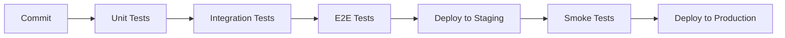

# 10 - Estratégia de Testes

## 🧪 Visão Geral

Estratégia abrangente de testes para garantir qualidade, confiabilidade e performance do sistema.

## 📋 Tipos de Teste

### ✅ Implementado
- [x] **Testes Unitários** - Funções e hooks isolados
- [x] **Testes de Integração** - Componentes + APIs
- [x] **Testes E2E** - Fluxos críticos de usuário

### 🔄 Em Desenvolvimento  
- [ ] **Testes de Performance** - Load testing
- [ ] **Testes de Segurança** - Penetration testing
- [ ] **Testes de Acessibilidade** - A11y compliance

### 📝 Planejado
- [ ] **Testes Visuais** - Regressão de UI
- [ ] **Testes de API** - Contract testing
- [ ] **Testes de Carga** - Stress testing

## 🎯 Cobertura de Testes

| Componente | Cobertura | Meta |
|------------|-----------|------|
| **Utils/Helpers** | 95% | 95% |
| **Hooks** | 85% | 90% |
| **Components** | 70% | 85% |
| **Services** | 80% | 90% |
| **Pages** | 60% | 75% |

## 🚀 Pipeline de Testes

## 📊 Métricas de Qualidade

- **Bug Rate**: < 0.5 bugs/feature
- **Test Execution Time**: < 10 min
- **Flaky Test Rate**: < 5%
- **Mean Time to Fix**: < 4 hours